# FRA532 LAB1

<p align="center">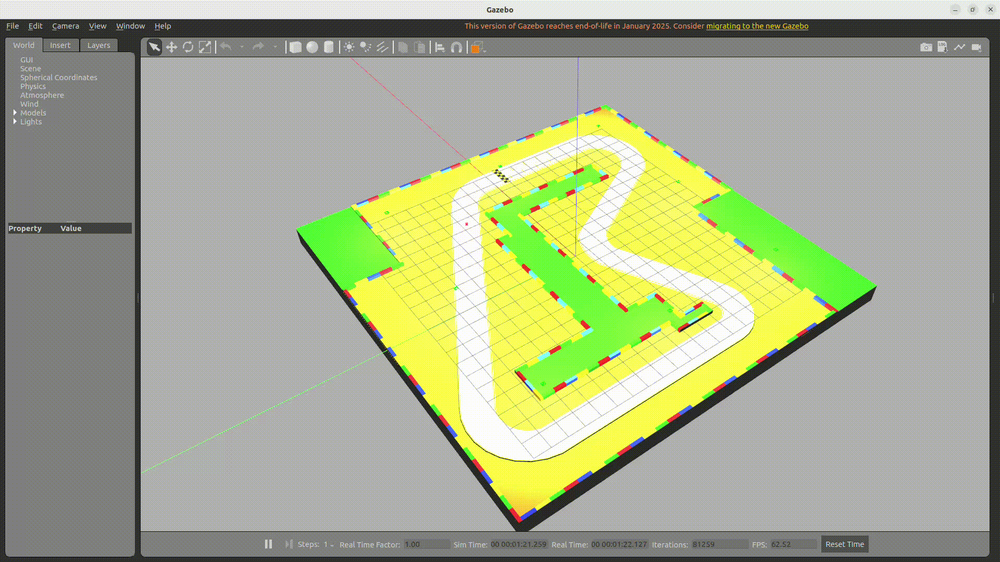</p>

<!-- TABLE OF CONTENTS -->
## Table of Contents
<ol>
    <li>
        <a href="#about-the-project">About The Project</a>
        <ul>
            <li><a href="#system-architecture">System Architecture</a></li>
        </ul>
    </li>
    <li>
        <a href="#getting-started">Getting Started</a>
        <ul>
        <li><a href="#prerequisites">Prerequisites</a></li>
            <ul>
                <li><a href="#python-packages">Python packages</a></li>
                <li><a href="#ros2-packages">ROS2 packages</a></li>
            </ul>
        <li><a href="#installation">Installation</a></li>
        </ul>
    </li>
    <li><a href="#usage">Usage</a></li>
    <ul>
        <li><a href="#launch-the-project">Launch the project</a></li>
        <li><a href="#run-the-controller-node">Run the controller node</a></li>
    </ul>
    <li><a href="#kinematics-of-mobile-robot">Kinematics of Mobile robot</a></li>
        <ul>
            <li><a href="#1-robot-model">Robot model</a></li>
            <li><a href="#2-inverse-kinematics-models">Inverse Kinematics Models</a></li>
            <li><a href="#3-forward-kinematics-models">Forward Kinematics Models</a></li>
            <li><a href="#4-validation">Validation</a></li>
            <li><a href="#5-conclusion">Conclusion</a></li>
        </ul>
    <li><a href="#path-tracking-controller">Path tracking controller</a></li>
        <ul>
            <li><a href="#1-controller-selection">Controller selection</a></li>
            <li><a href="#2-pid-controller">PID controller</a></li>
            <li><a href="#3-pure-pursuit-controller">Pure Pursuit controller</a></li>
            <li><a href="#4-stanley-controller">Stanley controller</a></li>
            <li><a href="#5-conclusion-1">Conclusion</a></li>
        </ul>
    <li><a href="#state-estimator">State estimator</a></li>
    <ul>
        <li><a href="#1-introduction-to-kalman-filter">Introduction to Kalman Filter</a></li>
        <li><a href="#2-problem-formulation">Problem Formulation</a></li>
        <li><a href="#3-ekf-algorithm-steps">EKF Algorithm Steps</a></li>
        <li><a href="#4-understanding-matrix-q-and-r">Understanding Matrix Q and R</a></li>
        <li><a href="#5-implementation">Implementation</a></li>
        <li><a href="#6-results-without-tuning">Results without tuning</a></li>
        <li><a href="#7-tuning-configurations-and-results">Tuning Configurations and Results</a></li>
        <li><a href="#8-interpretation">Interpretation</a></li>
        <li><a href="#9-conclusion">Conclusion</a></li>
    </ul>
    <li><a href="#contributors">Contributors</a></li>
</ol>

<!-- ABOUT THE PROJECT -->
## About The Project

This project is in FRA532(Mobile Robotics) class at **FIBO** that teach about Mobile robotics. So **LAB1** is the one of class's lab that have 3 sub-labs that are kinematics of mobile robot, path tracking controller, and state estimator.

### System Architecture

<!-- GETTING STARTED -->
## Getting Started

### Prerequisites

To use this project. You need to have all of prerequisites for this project.

#### Python packages

> [!WARNING]
> Make sure you have python version >= 3.6 already.

*   numpy

    ```
    pip3 install numpy
    ```

*   matplotlib

    ```
    pip3 install matplotlib
    ```

* tf_transformations

    ```
    pip3 install tf_transformations
    ```

* pyyaml

    ```
    pip3 install pyyaml
    ```

#### ROS2 packages

> [!WARNING]
> Make sure you have ROS2 humble and gazebo classic already.

* robot state publisher

    ```
    sudo apt install ros-humble-robot-state-publisher
    ```

* ros2 control

    ```
    sudo apt install ros-humble-ros2-control
    ```

* ros2 controllers

    ```
    sudo apt install ros-humble-ros2-controllers
    ```

* gazebo ros2 control

    ```
    sudo apt install ros-humble-gazebo-ros2-control
    ```

### Installation

Follow the command below to dowload and install package.

1.  Go to home directory

    ```
    cd
    ```

2.  Clone the repository and change directory to workspace

    ```
    git clone https://github.com/itsnotthetim/FRA532_LAB1.git
    cd FRA532_LAB1
    ```

3.  Build & Source the packages

    ```
    colcon build
    source install/setup.bash
    ```

<p align="right">(<a href="#fra532-lab1">back to top</a>)</p>

<!-- USAGE -->
## Usage

> [!IMPORTANT]
> Before use this project you need to `source ~/FRA532_LAB1/install/setup.bash` and `source /opt/ros/humble/setup.bash` everytime that you open new terminal. If you want to make sure that 2 path has been source everytime when open new terminal you can follow the command below and next time you open new terminal .bashrc will source everything you write on that file.

```
echo "source ~/FRA532_LAB1/install/setup.bash" >> ~/.bashrc
echo "source /opt/ros/humble/setup.bash" >> ~/.bashrc
source ~/.bashrc
```

### Launch the project

```
ros2 launch ack_description sim.launch.py
```

After launch the project, rviz2 and gazebo window will show up on your screen with ackermann robot in gazebo world like this picture below.

<p align="center">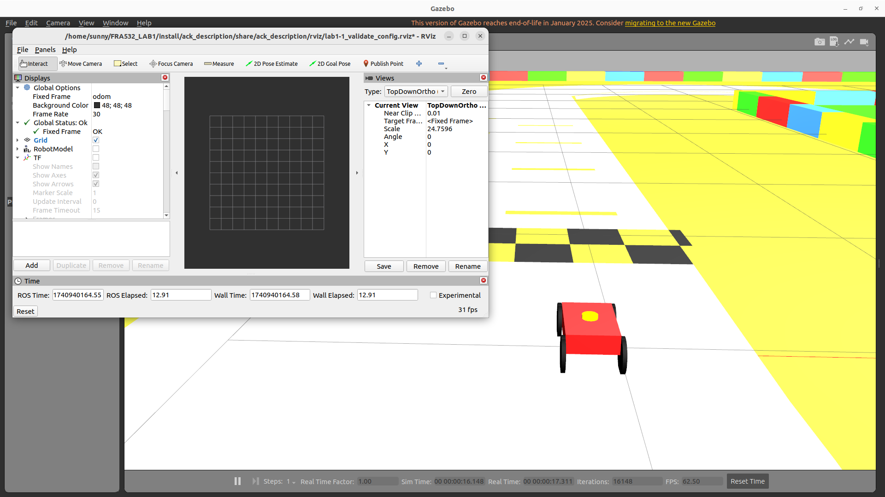</p>

### Run the controller node

To use controller for path tracking in lab 1.2 and 1.3, you can use this command below to start the controller node.

```
ros2 run ackermann_controller <controller_node>
```

Example: To run the pure pursuit controller you can use this command below.

```
ros2 run ackermann_controller pure_pursuit_controller.py
```

This step will explain more in <a href="#path-tracking-controller">Lab 1.2</a> section.

<p align="right">(<a href="#fra532-lab1">back to top</a>)</p>

## Kinematics of Mobile robot

This section provided robot model with inverse and forward kinematics for simulate, control, and calculate odometry of robot.

### 1 Robot model

#### 1.1 Robot description

Robot description is the part that have to use for visualize in rviz and simulate in gazebo. You can check our robot description <a href="src/ack_description/urdf/robot.xacro">here</a>.

<p align="center">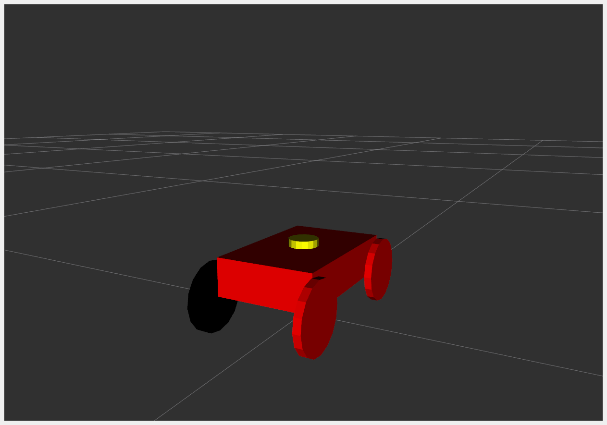</p>

This model is based on intruction of this lab, see below.

<p align="center">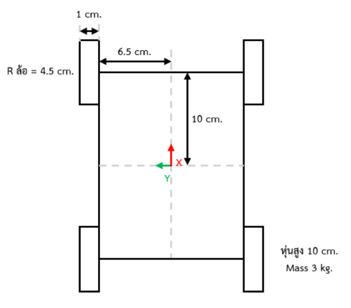</p>

Additionaly, for <a href="#31-yaw-rate-model">Yaw-Rate Model</a> we add imu sensor frame (yellow cylinder on the head) to simulate imu sensor and link it into gazebo.

#### 1.2 Transformation

<p align="center"></p>

The transformation tree is:

* base_link
    * chassis
        * left_rear_wheel_link
        * left_steer_link
            * left_front_wheel_link
        * right_rear_wheel_link
        * right_steer_link
            * right_front_wheel_link
        * imu_link

And after we create robot odometry transformation tree will change into this:

* world
    * odom
        * base_link
            * chassis
                * left_rear_wheel_link
                * left_steer_link
                    * left_front_wheel_link
                * right_rear_wheel_link
                * right_steer_link
                    * right_front_wheel_link
                * imu_link

If we use `view frame` of `tf2_tools`, the result is a image below.

<p align="center">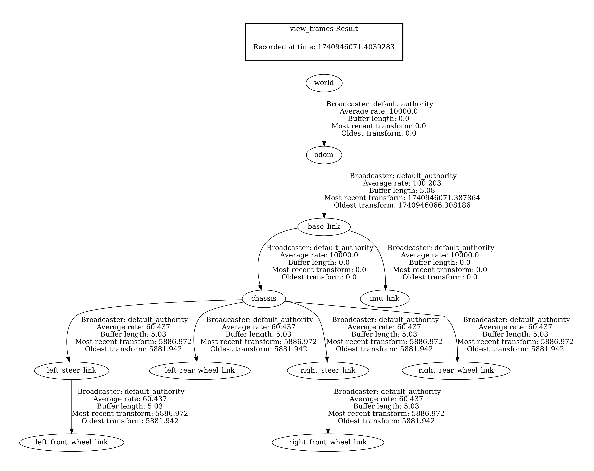</p>

### 2 Inverse Kinematics Models

Inverse kinematics models is using for calculate twist at robot frame into wheel speed.

#### 2.1 Bicycle Model

<p align="center">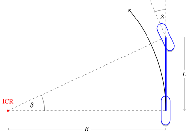</p>

**Description**  

- A simplified model representing a four-wheel Ackermann vehicle using one front steering wheel and one rear driving wheel.  
- The front wheel turns at an angle $\delta$, and the rear wheel drives the vehicle forward.

**Key Equations** 

$$
\dot{x} = v \cos(\theta)
$$

$$
\dot{y} = v \sin(\theta)
$$

$$
\dot{\theta} = \frac{v}{L} \tan(\delta)
$$

To find the required steering angle $\delta$:

$$
\delta = \arctan\left(\frac{L \dot{\theta}}{v}\right)
$$

#### 2.2 No-Slip Condition Model

<p align="center">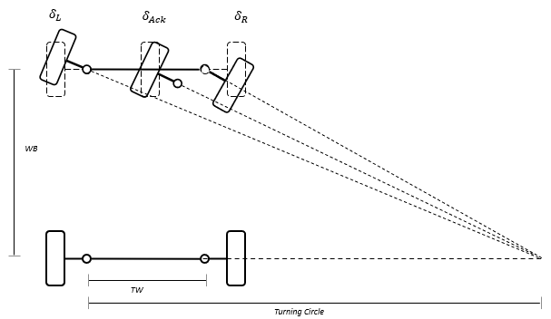</p>

**Description**  
- Assumes that wheels roll without slipping, meaning all wheels must share the same turning center.  
- The left and right front wheels turn at different angles to follow Ackermann steering.

**Key Equations**  

$$
\cot(\delta_L) - \cot(\delta_R) = \frac{TW}{WB}
$$

$$
\delta_{Ack} = \frac{\delta_{in}}{\gamma}
$$

$$
\delta_L = \tan^{-1}\left( \frac{WB \cdot \tan(\delta_{Ack})}{WB + 0.5 \cdot TW \cdot \tan(\delta_{Ack})} \right)
$$

$$
\delta_R = \tan^{-1}\left( \frac{WB \cdot \tan(\delta_{Ack})}{WB - 0.5 \cdot TW \cdot \tan(\delta_{Ack})} \right)
$$

Where:
- $\delta_L$ and $\delta_R$ are the left and right wheel angles, respectively.
- $\delta_{Ack}$ is the Ackermann angle.
- $\delta_{in} $ is the input steering angle.
- $\gamma$ is a scaling factor.
- $TW$ is the track width (distance between the left and right wheels).
- $WB$ $is the wheelbase (distance between the front and rear axles).
- $P_{Ack}$ is the Ackermann percentage.

---

> [!NOTE]
> In case, the code for the Bicycle model and the No-Slip Condition Constraints model shares similar equations, the implementation will be mostly the same, with some differences specific to each model. The code will look like this(<a href="src/ackermann_controller/scripts/ackermann_ik.py#L40-L72">inverse kinematics script</a>).

```python 
    def cmd_vel_callback(self, msg: Twist):
        self.linear_velocity = msg.linear.x  # Forward velocity (m/s)
        self.angular_velocity = msg.angular.z  # Rotation velocity (rad/s)

        if self.linear_velocity != 0.0:
            delta = math.atan((self.WB * self.angular_velocity) / self.linear_velocity)

            delta_Ack = delta / self.gamma
            delta_L = math.atan((self.WB * math.tan(delta_Ack)) / (self.WB - 0.5 * self.TW * math.tan(delta_Ack)))
            delta_R = math.atan((self.WB * math.tan(delta_Ack)) / (self.WB + 0.5 * self.TW * math.tan(delta_Ack)))
        
        else:
            delta = 0.0
            delta_Ack = 0.0
            delta_L = 0.0
            delta_R = 0.0

        if self.model == 'bicycle':
            steering_angle_left_wheel = delta
            steering_angle_right_wheel = delta
        elif self.model == 'ackermann':
            steering_angle_left_wheel = delta_L
            steering_angle_right_wheel = delta_R

        speed_rear_wheel = self.linear_velocity / self.wheel_radius

        front_wheel_msg = Float64MultiArray()
        front_wheel_msg.data = [steering_angle_left_wheel, steering_angle_right_wheel]
        self.front_wheel_publisher.publish(front_wheel_msg)

        rear_wheel_msg = Float64MultiArray()
        rear_wheel_msg.data = [speed_rear_wheel, speed_rear_wheel]
        self.rear_wheel_publisher.publish(rear_wheel_msg)
```

### 3 Forward Kinematics Models

Forward kinematics models is using for calculate wheel speed into robot twist(at robot frame).

#### 3.1 Yaw-Rate Model

<p align="center">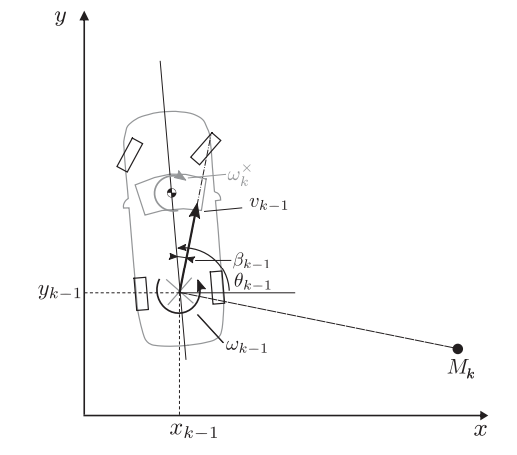</p>

**Description**

- Yaw Rate model estimates a vehicle’s rotational speed around its vertical axis, essential for dead reckoning-based odometry. By integrating the yaw rate over time, the robot or vehicle can estimate its heading. This is often combined with wheel encoder data and IMU (Inertial Measurement Unit) readings to improve accuracy in mobile robots and self-driving cars (Autonomous).

**Key Equations** 

$$
\begin{align*}
\begin{bmatrix}
x_k \\
y_k \\
\theta_k \\
\beta_k \\
v_k \\
\omega_k
\end{bmatrix}
&=
\begin{bmatrix}
y_{k-1} + v_{k-1} \cdot \Delta t \cdot \cos\left(\beta_{k-1} + \theta_{k-1} + \frac{\omega_{k-1} \cdot \Delta t}{2}\right) \\
y_{k-1} + v_{k-1} \cdot \Delta t \cdot \sin\left(\beta_{k-1} + \theta_{k-1} + \frac{\omega_{k-1} \cdot \Delta t}{2}\right) \\
\theta_{k-1} + \omega_{k-1} \cdot \Delta t \\
\beta_{R,k}^{\ast} \\
\frac{v_{R,L,k}^{\ast} + v_{R,R,k}^{\ast}}{2} \\
\quad \frac{v_{k-1}}{r_b} \left(\cos(\beta_{R,k}^{\ast}) \cdot (\tan(\beta_{F,k}^{\ast}) - \tan(\beta_{R,k}^{\ast}))\right)
\end{bmatrix}
\end{align*}
$$

#### 3.2 Single-Track Model

<p align="center">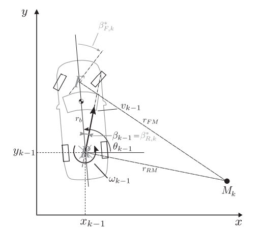</p>

**Description**

- Single-Track model approximates a four-wheeled vehicle as a single-track system, treating both left and right wheels as one virtual wheel per axle. 
- It simplifies kinematic calculations for estimating the vehicle's position and orientation to determine velocity and heading changes..

**Key Equations**

$$\begin{align*}
\begin{bmatrix}
x_k \\
y_k \\
\theta_k \\
\beta_k \\
v_k \\
\omega_k
\end{bmatrix}
&=
\begin{bmatrix}
y_{k-1} + v_{k-1} \cdot \Delta t \cdot \cos\left(\beta_{k-1} + \theta_{k-1} + \frac{\omega_{k-1} \cdot \Delta t}{2}\right) \\
y_{k-1} + v_{k-1} \cdot \Delta t \cdot \sin\left(\beta_{k-1} + \theta_{k-1} + \frac{\omega_{k-1} \cdot \Delta t}{2}\right) \\
\theta_{k-1} + \omega_{k-1} \cdot \Delta t \\
\beta_{R,k}^{\ast} \\
\frac{v_{R,L,k}^{\ast} + v_{R,R,k}^{\ast}}{2} \\
\quad \frac{v_{k-1}}{r_b} \left(\cos(\beta_{R,k}^{\ast}) \cdot (\tan(\beta_{F,k}^{\ast}) - \tan(\beta_{R,k}^{\ast}))\right)
\end{bmatrix}
\end{align*}$$

#### 3.3 Double-Track Model

<p align="center">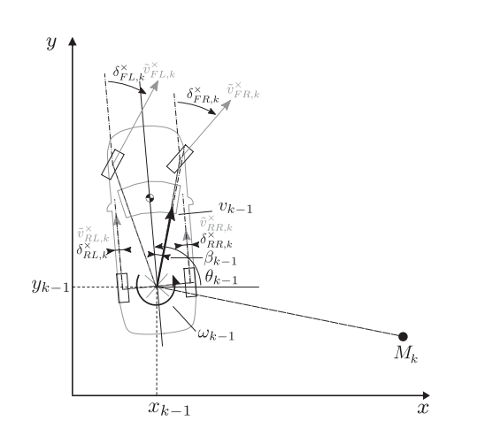</p>

**Description**

- Double-Track model considers each wheel independently to make it more precise for odometry. By accounts for lateral wheel slips, load transfers, and individual wheel speeds. This is useful in high-accuracy odometry for vehicles with independent drive wheels or complex dynamics like four-wheeled mobile robots (ackerman model like we did). 

**Key Equations**

$$\begin{align*}
\begin{bmatrix}
x_k \\
y_k \\
\theta_k \\
\beta_k \\
v_k \\
\omega_k
\end{bmatrix}
&=
\begin{bmatrix}
x_{k-1} + v_{k-1} \cdot \Delta t \cdot \cos\left(\beta_{k-1} + \theta_{k-1} + \frac{\omega_{k-1} \cdot \Delta t}{2}\right) \\
y_{k-1} + v_{k-1} \cdot \Delta t \cdot \sin\left(\beta_{k-1} + \theta_{k-1} + \frac{\omega_{k-1} \cdot \Delta t}{2}\right) \\
\theta_{k-1} + \omega_{k-1} \cdot \Delta t \\
0 \\
\frac{\tilde{v}_{RL,k} + \tilde{v}_{RR,k}}{2} \\
\frac{\tilde{v}_{RR,k} - \tilde{v}_{RL,k}}{TW}
\end{bmatrix}
\end{align*}$$

---

> [!NOTE]
> The code for all three models has a similar structure but differs in some equations, like those involving $\omega_k$, the implementation will mostly be the same, with some variations for each model. The code will look like this(<a href="src/ackermann_controller/scripts/ackermann_fk.py#L96-L114">forward kinematics script</a>).

```python
    def state_space(self):
        self.update_state_space = [0, 0, 0, 0, 0, 0]
        self.update_state_space[0] = self.odom[0] + (self.odom[4] * self.dt * math.cos(self.odom[3] + self.odom[2] + (self.odom[5]* self.dt)/2))
        self.update_state_space[1] = self.odom[1] + (self.odom[4] * self.dt * math.sin(self.odom[3] + self.odom[2] + (self.odom[5]* self.dt)/2))
        self.update_state_space[2] = self.odom[2] + (self.odom[5] * self.dt)
        self.update_state_space[4] = (self.rear_vel[0] + self.rear_vel[1]) / 2

        if(self.kinematic_model == 'single_track'):
            self.update_state_space[5] = (self.odom[4]/self.wheelbase) * math.tan(self.delta)
        elif(self.kinematic_model == 'double_track'):
            self.update_state_space[5] = (self.rear_vel[0] - self.rear_vel[1]) / self.track_width
        elif(self.kinematic_model == 'yaw_rate'):
            self.update_state_space[5] = self.yaw
        if self.kinematic_model != 'ground_truth':
            self.odom = self.update_state_space
            self.odom_pub(self.odom)
        else:
            self.odom = self.odom_ground_truth
            self.odom_pub(self.odom_ground_truth)
```

---

### 4 Validation

To compare and validate the result, we have to analyze as follows:

1. Position.
2. Orientation.

For see which model is stronger in which aspect or what is the strong point of those models. Additionally, the results will based on <a href="#2-inverse-kinematics-models">inverse kinematics model</a>.

> [!NOTE]
> In the validation process, we use <a href="#pure-pursuit-controller">pure pursuit controller </a> to be our controller to move the robot around the map via tracking the path.

The results for each model are shown in the following graphs below:

1. Bicycle Model

    * Path tracking velocity = 0.25 m/s

        <p align="center">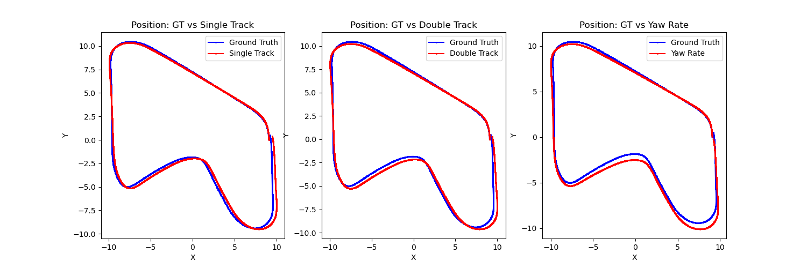</p>

        <p align="center">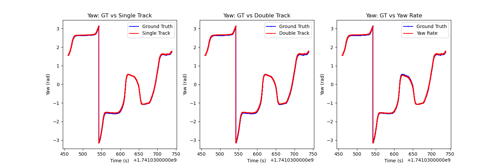</p>

        <p align="center">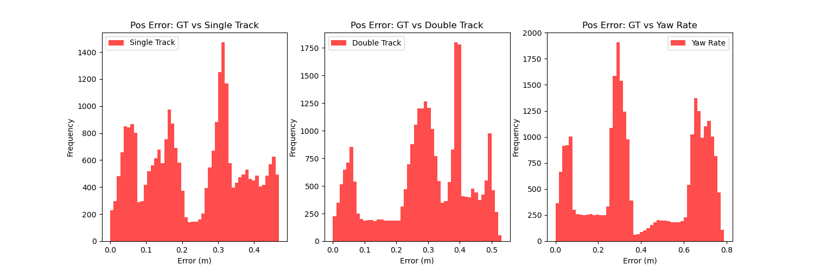</p>

        <p align="center">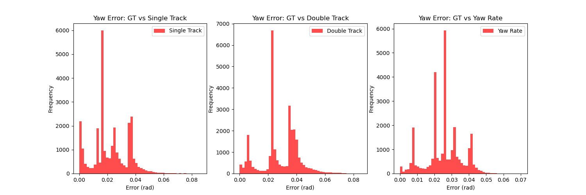</p>

    * Path tracking velocity = 0.5 m/s

        <p align="center">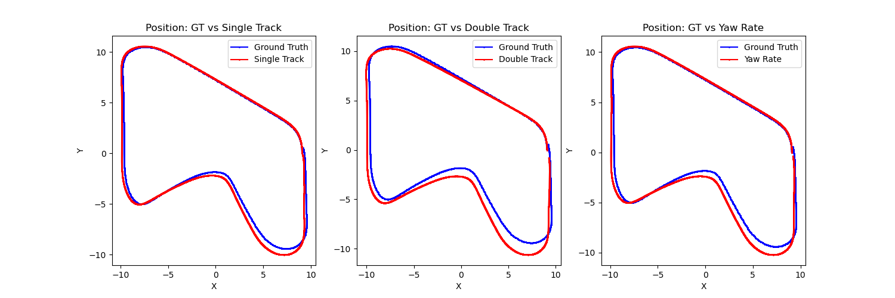</p>

        <p align="center">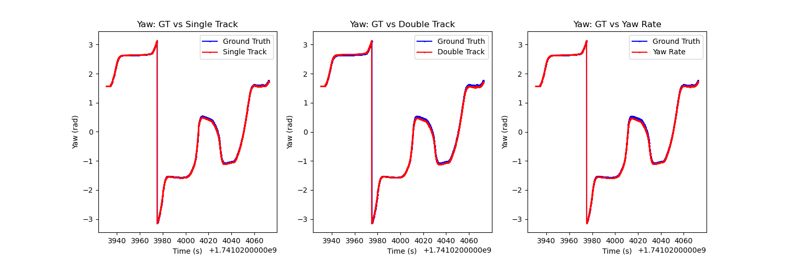</p>

        <p align="center">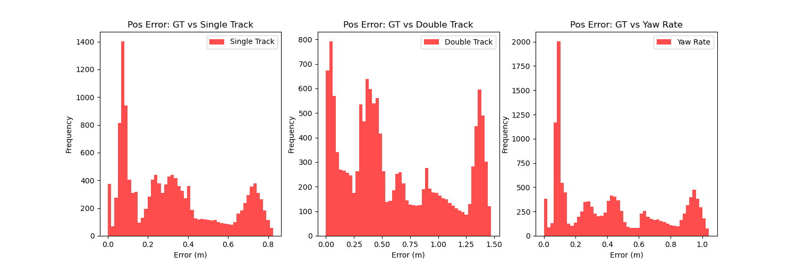</p>

        <p align="center">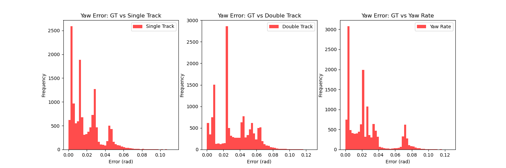</p>

        ---

2. No-Slip Condition Model

    * Path tracking velocity = 0.25 m/s

        <p align="center">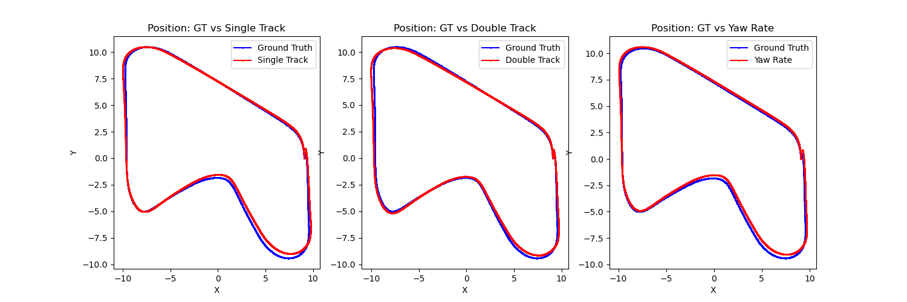</p>

        <p align="center">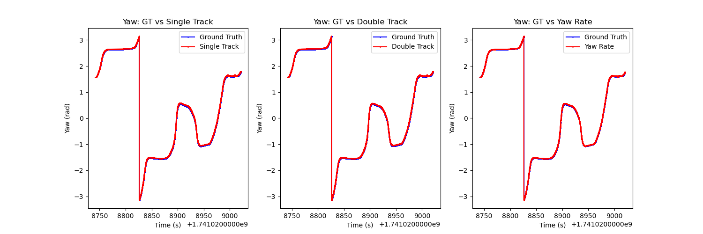</p>

        <p align="center">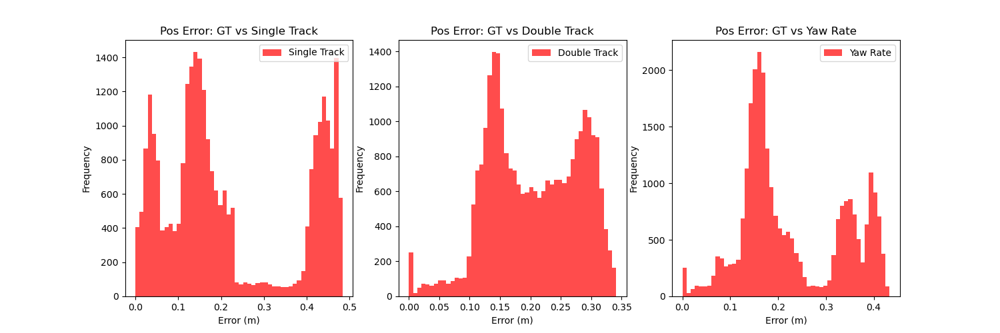</p>

        <p align="center">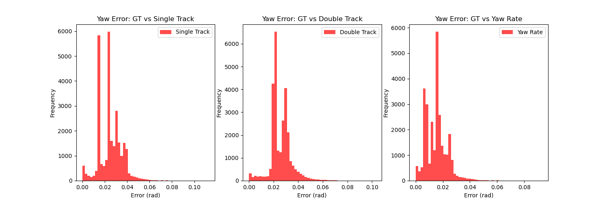</p>

        ---

    * Path tracking velocity = 0.5 m/s

        <p align="center">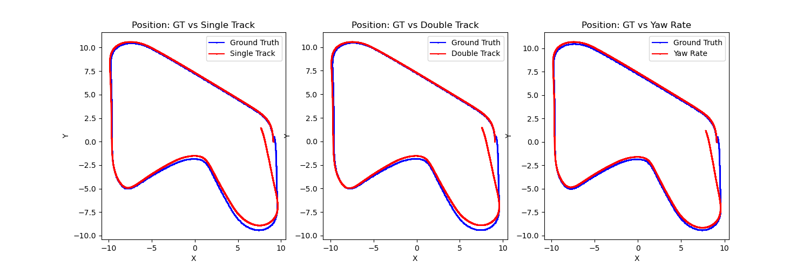</p>

        <p align="center">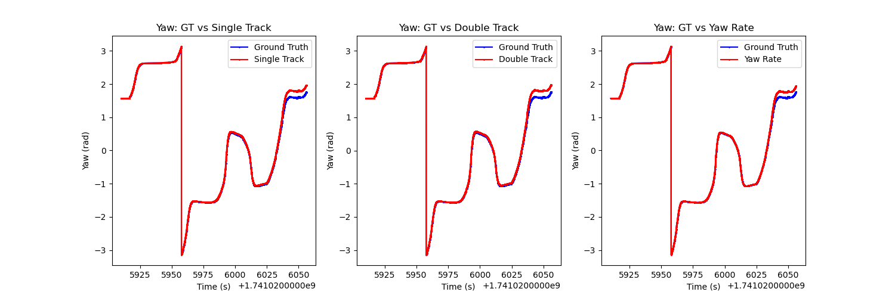</p>

        <p align="center">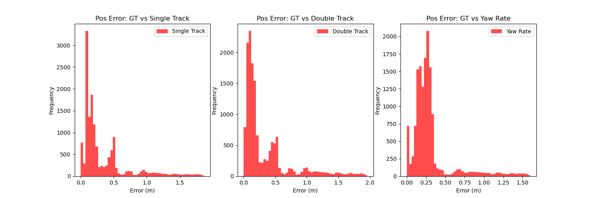</p>

        <p align="center">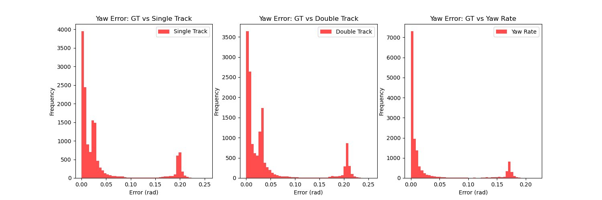</p>

        ---

### 5 Conclusion


**Model selection guide**

- **Inverse Kinematics**  
  - **Bicycle Model**: Best for simple path-following and control.  
  - **No-Slip Model**: Best for precise low-speed maneuvers.  

- **Forward Kinematics**  
  - **Yaw-Rate Model**: Easy to implement; works well with IMU.  
  - **Single-Track Model**: More accurate for steering-based motion.
  - **Double-Track Model**: Best for high-speed and complex dynamics.

<p align="right">(<a href="#fra532-lab1">back to top</a>)</p>

## Path tracking controller

Path tracking controller or local planner is the algorithm to tracking the path that given from somewhere like global planner. The goal of this algorithm is based on what mission robot need to do, in this case is only to track the path.

### 1 Controller selection

To select the controllers that given by instruction(PID, Pure Pursuit, Linear MPC, and Stanley). We based on the mission of robot that is tracking the path. And all of controllers in instruction can track the path. So we selected them by using this rules below.

1. What kind of environments do robots face?
2. The need for smoothness of the robot in following the path.
3. How difficult is it to implement?

> [!NOTE]
> To test the controller we use <a href="#21-bicycle-model">bicycle model</a> and ground truth odometry to be our inverse and forward kinematics model.

### 2 PID controller

This controller is the basic controller to implement in many systems, including this task path tracking controller. PID has main three terms to control system such as proportional, integral, and derivative.

**Key Concepts**

* **Cross-Track Error:**
    This is the perpendicular distance from the robot’s current position to the nearest point on the desired path. The equation is given by:

    $$
    \text{CTE} = \sqrt{(x_{\text{closest}} - x_{\text{robot}})^2 + (y_{\text{closest}} - y_{\text{robot}})^2}
    $$

    Where:
    - $x_{\text{robot}}$ and $y_{\text{robot}}$ are the coordinates of the robot's current position.
    - $x_{\text{closest}}$ and $y_{\text{closest}}$ are the coordinates of the closest point on the path.

* **Proportional term:**
    Applies a correction proportional to the current error. The equation is given by:

    $$P = K_p \cdot e(t)$$

    Where $e(t)$ is the error at time $t$ and $K_p$ is the proportional gain.

* **Integral term:**
    Accumulates past errors to eliminate residual steady-state error. The equation is given by:

    $$I = K_i \cdot \int_{0}^{t} e(\tau) \, d\tau$$

    Where $K_i$ is the integral gain.

* **Derivative term:**
    Predicts future error based on the rate of change, helping to dampen the system. The equation is given by:

    $$D = K_d \cdot \frac{de(t)}{dt}$$

    Where $K_d$ is the integral gain.

* **Combinded PID controller law:**

    $$u(t) = K_p \cdot e(t) + K_i \cdot \int_{0}^{t} e(\tau) \, d\tau + K_d \cdot \frac{de(t)}{dt}$$

> [!NOTE]
> You can study more about this controller via this <a href="https://thomasfermi.github.io/Algorithms-for-Automated-Driving/Control/PID.html">link</a>.

We chose this controller because the environments that our robot faced was not difficult to run with PID controller. Additionally, PID controller can make robot tracking the path as well with cross track error.

#### 2.1 Implementation

According to the key concepts. We implement the PID controller, cross-track error calculation, and steering angle via this code.

* **PID controller:**

    ```python
    def update_controller(self, error, sat):
        """
        Updates PID controller output based on error input.
        
        Args:
            error: Current error (setpoint - measured_value)
            at: Output saturation limits (±sat)
        
        Returns:
            float: Controller output
        """
        e_n = error  # Current error sample

        # Anti-windup logic:
        # Only update controller if:
        # 1. Output is not saturated, or
        # 2. Error is trying to reduce the output
        if not ((self.y_n >= sat and e_n > 0) or (self.y_n <= -sat and e_n < 0)):
            # PID equation in discrete form:
            self.y_n += ((self.kp + self.ki + self.kd) * e_n) - ((self.kp + (2 * self.kd)) * self.e_n_1) + (self.kd * self.e_n_2)

        # Update error history for next iteration
        self.e_n_2 = self.e_n_1
        self.e_n_1 = e_n
        self.e_n = e_n
        
        # Saturate output to prevent excessive control signals
        if self.y_n > sat:
            self.y_n = sat
        elif self.y_n < -sat:
            self.y_n = -sat

        return self.y_n
    ```

* **cross-track error calculation:**

    ```python
    def get_cte(self, robot_x, robot_y, path_x, path_y, last_index, maxsearch_index=50, goal_threshold=0.5):
        # Convert path points to numpy arrays
        path_points = np.column_stack((path_x[last_index:(last_index+maxsearch_index+1)], path_y[last_index:(last_index+maxsearch_index+1)]))
        robot_pos = np.array([robot_x, robot_y])

        # Compute Euclidean distances from robot to all path points
        distances = np.linalg.norm(path_points - robot_pos, axis=1)

        # Find the closest path point
        min_index = np.argmin(distances)
        closest_point = path_points[min_index]
        
        # Compute CTE as Euclidean distance
        cte = float(distances[min_index])
        goal_reached = (last_index == len(path_x) - 1) and (cte < goal_threshold)

        last_index += min_index

        return cte, last_index, goal_reached
    ```

* **Steering angle:**

    ```python
    angular_z = float(self.ang_pid.update_controller(error_long, 5))
    ```

> [!NOTE]
> You can check the PID controller node in this <a href="src/ackermann_controller/scripts/pid_controller.py">file</a>.

#### 2.2 Results

To run this controller, you can follow this command below:

```
ros2 run ackermann_controller pid_controller.py
```

* Slow velocity (0.25 m/s)

<p align="center"></p>

* Fast velocity (0.5 m/s)

<p align="center"></p>

### 3 Pure Pursuit controller

This controller is is a geometric method used for path tracking in autonomous vehicles and mobile robots. Its main goal is to generate steering commands that guide the vehicle along a predefined path.

**Key Concepts**

* **Lookahead Point:**
    The controller identifies a target point on the path a fixed distance (lookahead distance) ahead of the vehicle. This distance is often chosen based on the vehicle's speed and desired responsiveness.

* **Geometric Relationship:**
    The controller computes the curvature required to steer the vehicle toward the lookahead point. Essentially, it draws a virtual circle passing through the vehicle’s current position and the lookahead point.

* **Steering Angle Calculation:**
    The required steering angle is determined by the curvature of the circle. The curvature $\kappa$ is given by:

    $$\kappa = \frac{2 \sin(\alpha)}{L_d}$$

    where:

    * $\alpha$ is the angle between the vehicle's heading and the line connecting it to the lookahead point.

    * $L_d$ is the lookahead distance.


> [!NOTE]
> You can study more about this controller via this <a href="https://thomasfermi.github.io/Algorithms-for-Automated-Driving/Control/PurePursuit.html">link</a>.

We chose this controller because it is straightforward to implement and works well on smooth paths.

#### 3.1 Implementation

According to the key concepts. We calculate the heading error, steering angle via this code.

* **Heading error:**

    ```python
    alpha = target_angle - self.yaw
    ```

* **Steering angle:**

    ```python
    delta = math.atan2(2 * self.wheelbase * math.sin(alpha), self.lookahead_distance)
    v = 0.5 # Linear velocity
    w = (2 * v * math.sin(delta)) / self.wheelbase # Angular velocity
    ```

> [!NOTE]
> You can check the Pure Pursuit controller node in this <a href="src/ackermann_controller/scripts/pure_pursuit_controller.py">file</a>.

#### 3.2 Results

To run this controller, you can follow this command below:

```
ros2 run ackermann_controller pure_pursuit_controller.py
```

* Slow velocity (0.25 m/s)

<p align="center"></p>

* Fast velocity (0.5 m/s)

<p align="center"></p>

### 4 Stanley controller

This controller is a widely used algorithm for path tracking in autonomous vehicles. Developed at Stanford University, it focuses on minimizing the vehicle's lateral error relative to a predefined path.

**Key Concepts:**

* **Cross-Track Error:**
    This is the perpendicular distance from the vehicle’s current position to the nearest point on the desired path. (<a href="#2-pid-controller">Same as PID controller concepts</a>)

* **Heading Error:**
    The difference between the vehicle's current heading and the tangent (direction) of the path at the nearest point.

* **Steering Command Calculation:**
    The Stanley controller computes the steering angle ($\delta$) by combining the heading error with a term that accounts for the cross-track error. The typical formula is:

    $$\delta = \theta_e + \arctan\left(\frac{k \cdot e}{v}\right)$$

    Where:

    * $\theta_e$ is the heading error.
    * $e$ is the cross-track error.
    * $k$ is a tuning parameter that adjusts the controller's sensitivity.
    * $v$ is the vehicle's current speed.

> [!NOTE]
> You can study more about this controller via this <a href="https://www.ri.cmu.edu/pub_files/2009/2/Automatic_Steering_Methods_for_Autonomous_Automobile_Path_Tracking.pdf">link</a>.

We chose this controller because it is performs well under a variety of conditions and is especially effective for tracking smooth paths. Additionally, Its geometric approach makes the controller straightforward to implement.

#### 4.1 Implementation

According to the key concepts. We calculate the heading error, cross-track error, Stanley control law, and Steering Angle via this code.

* **Heading error:**

    ```Python
    heading_error = path_heading - self.yaw
    heading_error = math.atan2(math.sin(heading_error), math.cos(heading_error))
    ```

* **Cross-Track error:**

    ```Python
    cross_track_error = math.sqrt(dx ** 2 + dy ** 2)
    sign = -1 if math.sin(self.yaw) * dx - math.cos(self.yaw) * dy > 0 else 1
    cross_track_error *= sign
    ```

* **Stanley control law:**

    ```Python
    steering_angle = heading_error + math.atan2(self.k * cross_track_error, self.velocity)
    steering_angle = max(min(steering_angle, math.pi / 4), -math.pi / 4)
    ```
* **Steering angle:**

    ```Python
    angular_velocity = (2 * self.velocity * math.sin(steering_angle)) / self.wheelbase
    ```

> [!NOTE]
> You can check the Stanley controller node in this <a href="src/ackermann_controller/scripts/stanley_controller.py">file</a>.

#### 4.2 Results

To run this controller, you can follow this command below:

```
ros2 run ackermann_controller 
```

* Slow velocity (0.25 m/s)

<p align="center"></p>

* Fast velocity (0.5 m/s)

<p align="center"></p>

### 5 Conclusion

<p align="right">(<a href="#fra532-lab1">back to top</a>)</p>

## State estimator

For accurate localization in mobile robot application, we use extended kalman filter to do sensor fusion for more accurate odometry.

### 1. Introduction to Kalman Filter

The **Kalman Filter** is an optimal recursive Bayesian estimator that predicts the state of a dynamic system and updates its estimates based on noisy sensor measurements. It assumes that the system follows a linear Gaussian model and consists of two main steps:

1. **Prediction:** The filter predicts the next state based on the motion model.
2. **Update (Correction):** The filter updates its state estimate using sensor observations.

For nonlinear systems, the **Extended Kalman Filter (EKF)** linearizes the system at each time step.

### 2. Problem Formulation

Given a mobile robot operating in a 2D space, the goal is to estimate its **position**  $\mu$  and **orientation**  $\theta$  based on odometry and sensor readings.

#### 2.1 State Representation

The system state is represented as:

$$X_k = \begin{bmatrix} x_k \\ y_k \\ \theta_k \end{bmatrix}$$

where:
- $x_k$ , $y_k$ are the position coordinates.
- $\theta_k$  is the orientation angle.

#### 2.2 Motion Model (Prediction Step)

The robot's motion is modeled by a control input \($U_k$\), which includes the velocity \($v_k$\) and angular velocity \($\omega_k$\):

$$X_{k+1} = f(X_k, U_k) + w_k$$

where:

$$\begin{bmatrix} x_{k+1} \\ y_{k+1} \\ \theta_{k+1} \end{bmatrix} =
\begin{bmatrix} x_k + v_k \Delta t \cos\theta_k \\ y_k + v_k \Delta t \sin\theta_k \\ \theta_k + \omega_k \Delta t \end{bmatrix} + w_k$$


- $w_k \sim \mathcal{N}(0, Q_k)$ represents process noise with covariance $Q_k$.

#### 2.3 Observation Model (Update Step)

Sensor measurements  $Z_k$  provide noisy observations of the actual state:

$$Z_k = h(X_k) + v_k$$

where:

$$Z_k = \begin{bmatrix} x_k^m \\ y_k^m \end{bmatrix} + v_k$$
and $v_k \sim \mathcal{N}(0, R_k)$ is the measurement noise with covariance $R_k$.

### 3. EKF Algorithm Steps

1. **Prediction Step:**

   $$\hat{X}_{k+1} = f(X_k, U_k)$$
   
   $$P_{k+1} = F_k P_k F_k^T + Q_k$$
   where $F_k$ is the Jacobian of $f(X_k, U_k)$.

2. **Update Step:**
   
   $$K_k = P_k H_k^T (H_k P_k H_k^T + R_k)^{-1}$$
 
   $$X_k = \hat{X}_k + K_k (Z_k - h(\hat{X}_k))$$
   
   $$P_k = (I - K_k H_k) P_k$$
  
   where H_k$ is the Jacobian of the measurement function \($h(X_k)$\), and K_k$ is the **Kalman Gain**.

### 4 Understanding Matrix Q and R

#### 4.1 Process Noise Covariance Matrix (Q)

- Represents uncertainty in the system's **motion model** due to unmodeled dynamics, control input inaccuracies, and external disturbances.
- Mathematically influences the state covariance update in the **prediction step**:
  
    $$P_{k+1} = F_k P_k F_k^T + Q_k$$ 
  
- **Large Q:** The filter adapts quickly but produces noisy estimates.
- **Small Q:** The filter is stable but slow to respond to changes.

So the matix $ Q$ should be like this


$$Q =
\begin{bmatrix}
\sigma_x^2 & 0 & 0 \\
0 & \sigma_y^2 & 0 \\
0 & 0 & \sigma_\theta^2
\end{bmatrix}$$


where:

-  $\sigma_x^2 $ and  $\sigma_y^2 $ represent **position uncertainty** (meters²),
-  $\sigma_\theta^2$  represents **heading uncertainty** (radians²).


#### 4.2 Measurement Noise Covariance Matrix (R)

- Represents uncertainty in **sensor measurements** due to sensor resolution limits, environmental interference, and sampling variations.
- Influences the **update step**:
  
   $$S_k = H_k P_k H_k^T + R_k$$ 
  
- **Large R:** The filter trusts the motion model more, reducing sensitivity to sensor noise but slowing adaptation.
- **Small R:** The filter follows sensor readings closely but may overreact to noise.

**Since the GPS provides measurements for x and y positions, the R matrix should be:**

Given that the GPS noise standard deviation is 0.05 meters, the variance is:

Thus, R should be:

```python
self.R = np.diag([0.0025, 0.0025])  # Fixed measurement noise covariance
```

- This assumes 0.05m standard deviation in GPS readings for both x and y.

- The EKF trusts GPS moderately but filters out small fluctuations.

### 5. Implementation

This code is in <a href="src/ackermann_controller/scripts/ekf_node.py">ekf_node.py</a>.

```python
#!/usr/bin/env python3

import rclpy
from rclpy.node import Node
import numpy as np
from nav_msgs.msg import Odometry
from geometry_msgs.msg import PoseStamped, Quaternion
import tf_transformations


class EKFLocalization(Node):
    def __init__(self):
        super().__init__('ekf_localization')

        # Subscribe to odometry and GPS
        self.odom_sub = self.create_subscription(Odometry, '/double_track/odom', self.odom_callback, 10)
        self.gps_sub = self.create_subscription(PoseStamped, '/gps', self.gps_callback, 10)

        # Publisher for fused odometry
        self.ekf_pub = self.create_publisher(Odometry, '/ekf_odom', 10)

        # State vector: [x, y, theta]
        self.x_est = np.array([0.0, 0.0, 0.0])  # Initial estimate
        self.P_est = np.eye(3) * 1.0  # Initial covariance matrix

        # Process and measurement noise covariance matrices
        
        self.R = np.diag([0.025, 0.025])  # Based on GPS measurement noise

       
        self.Q = np.diag([0.01, 0.01, 0.01]) 
        # self.Q = np.diag([0.001, 0.001, 0.001])
        # self.Q = np.diag([0.0001, 0.0001, 0.0001])  
        # self.Q = np.diag([0.001, 0.001, 0.0001]) 
        # self.Q = np.diag([0.0005, 0.0005, 0.0002]) 
        
        # Time step
        self.dt = 0.01

    def odom_callback(self, msg):
        """ EKF Prediction Step using Odometry """
        v = msg.twist.twist.linear.x  # Forward velocity
        omega = msg.twist.twist.angular.z  # Angular velocity
        theta = self.x_est[2]

        # State transition function (Prediction)
        x_pred = np.array([
            self.x_est[0] + v * np.cos(theta) * self.dt,
            self.x_est[1] + v * np.sin(theta) * self.dt,
            self.x_est[2] + omega * self.dt
        ])

        # Jacobian of motion model (F)
        F = np.array([
            [1, 0, -v * np.sin(theta) * self.dt],
            [0, 1,  v * np.cos(theta) * self.dt],
            [0, 0,  1]
        ])

        # Predicted covariance
        P_pred = F @ self.P_est @ F.T + self.Q

        # Update estimated values
        self.x_est = x_pred
        self.P_est = P_pred

        # Publish the updated estimate
        self.publish_estimate()

    def gps_callback(self, msg):
        """ EKF Update Step using GPS """
        z = np.array([msg.pose.position.x, msg.pose.position.y])  # Measurement

        # Measurement matrix (H)
        H = np.array([[1, 0, 0], [0, 1, 0]])

        # Innovation (residual)
        y = z - H @ self.x_est

        # Innovation covariance
        S = H @ self.P_est @ H.T + self.R

        # Kalman Gain
        K = self.P_est @ H.T @ np.linalg.inv(S)

        # Updated state estimate
        self.x_est = self.x_est + K @ y

        # Updated covariance
        self.P_est = (np.eye(3) - K @ H) @ self.P_est

        # Publish the updated estimate
        self.publish_estimate()

    def publish_estimate(self):
        """ Publish the EKF estimated pose as Odometry message """
        odom_msg = Odometry()
        odom_msg.header.stamp = self.get_clock().now().to_msg()
        odom_msg.header.frame_id = "odom"

        # Assign estimated state
        odom_msg.pose.pose.position.x = self.x_est[0]
        odom_msg.pose.pose.position.y = self.x_est[1]

        # Convert theta (yaw) to quaternion
        q = tf_transformations.quaternion_from_euler(0, 0, self.x_est[2])
        odom_msg.pose.pose.orientation = Quaternion(x=q[0], y=q[1], z=q[2], w=q[3])

        self.ekf_pub.publish(odom_msg)


def main(args=None):
    rclpy.init(args=args)
    node = EKFLocalization()
    rclpy.spin(node)
    node.destroy_node()
    rclpy.shutdown()


if __name__ == '__main__':
    main()
```

### 6. Results without tuning.

1. Yaw-Rate EKF

<p align="center">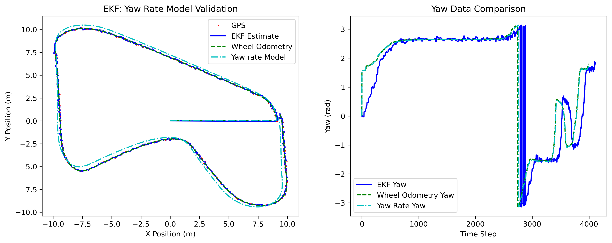</p>

2. Single-Track EKF

<p align="center">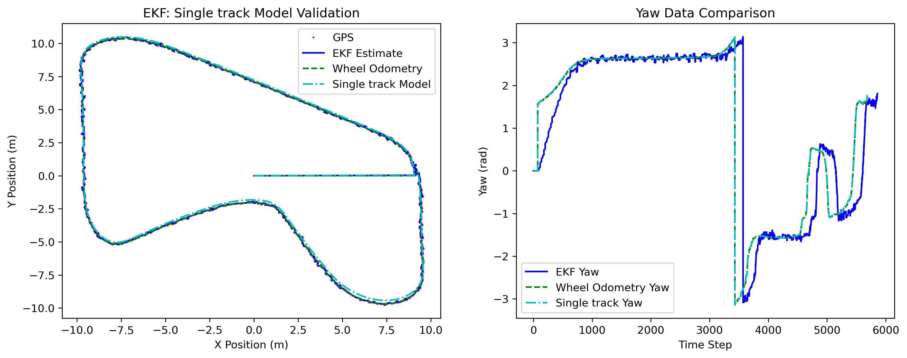</p>

3. Double-Track EKF

<p align="center">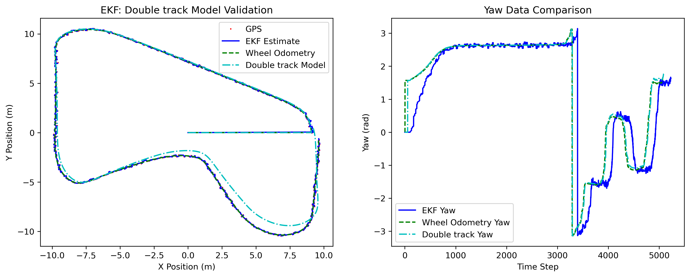</p>

### 7. Tuning Configurations and Results

We tested five different settings for **Q** with Ackerman steering type: <a href="#33-double-track-model">Double-track model</a> via <a href="#pure-pursuit-controller">Pure Pursuit controller</a> and recorded the errors for demonstrated how to tune the matrix Q. Here are the results:

#### 7.1 Initial Configuration 

<p align="center"></p>

- **Q**: `np.diag([0.01, 0.01, 0.01])`
- **Mean Position Error**: `0.1665 m`
- **Mean Yaw Error**: `0.1631 rad`

<p align="center">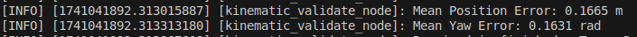</p>

#### 7.2 First Decrease in Q 

<p align="center">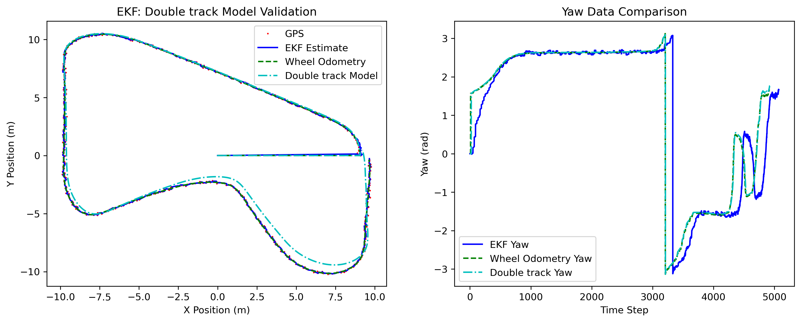</p>

- **Q**: `np.diag([0.001, 0.001, 0.001])`
- **Mean Position Error**: `0.0768 m`
- **Mean Yaw Error**: `0.0819 rad`

<p align="center">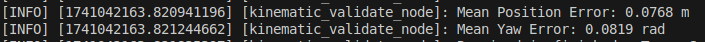</p>

#### 7.3 Second Decrease in Q 

<p align="center">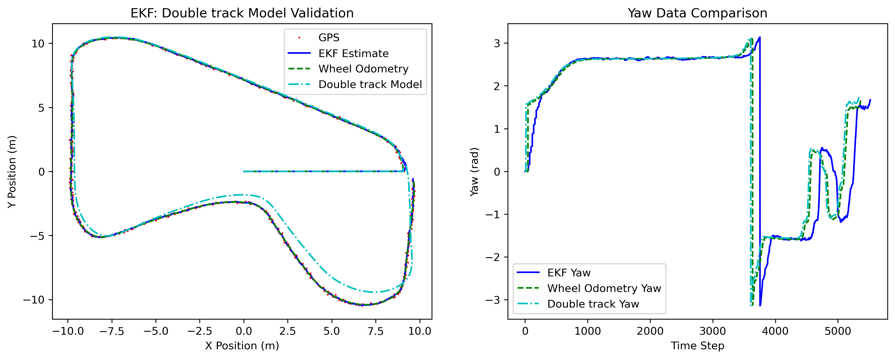</p>

- **Q**: `np.diag([0.0001, 0.0001, 0.0001])`
- **Mean Position Error**: `0.0909 m`
- **Mean Yaw Error**: `0.0671 rad`

<p align="center">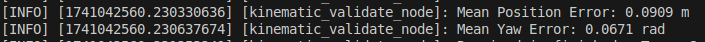</p>

#### 7.4 First Adjustment (`db_adj1.png`)

<p align="center">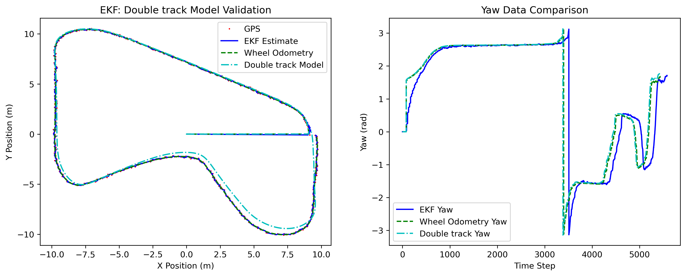</p>

- **Q**: `np.diag([0.001, 0.001, 0.0001])`
- **Mean Position Error**: `0.0668 m`
- **Mean Yaw Error**: `0.0644 rad`

<p align="center">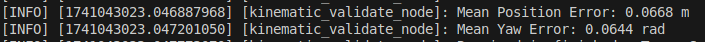</p>

#### 7.5 Second Adjustment (`db_adj2.png`)

<p align="center"></p>

- **Q**: `np.diag([0.0005, 0.0005, 0.0002])`
- **Mean Position Error**: `0.0625 m`
- **Mean Yaw Error**: `0.0513 rad`

<p align="center">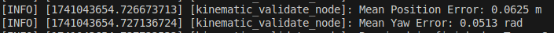</p>

### 8. Interpretation

#### 8.1 Initial Configuration

- **High Errors**: The initial guess had large errors because the filter trusted the motion model too much.

#### 8.2 First Decrease in Q

- **Better Accuracy**: Reduce **Q** to make the filter rely more on sensor data, which improved accuracy.

#### 8.3 Second Decrease in Q

- **Slight Problems**: Making **Q** even smaller caused the filter to trust the sensors too much, leading to small errors in position.

#### 8.4 First Adjustment

- **Good Balance**: Adjust **Q** to `[0.001, 0.001, 0.0001]` to gave a good mix of trusting the motion model and sensor data.

#### 8.5 Second Adjustment

- **Best Performance**: The final setting (`[0.0005, 0.0005, 0.0002]`) gave the lowest errors, making it the best choice.

**For the further tuning might not give the better result (not showing the significant difference) and will output the similar result (Probably the limitation ability of model, etc.)**

### 9. Conclusion

- **Tuning Q**: Finding the right balance for **Q** is key to making the EKF work well.
- **Best Setting**: The setting `np.diag([0.0005, 0.0005, 0.0002])` gave closer the optimal result.

<p align="right">(<a href="#fra532-lab1">back to top</a>)</p>

## Contributors

1. **Nakarin Jettanatummajit** (65340500033)
2. **Karanyaphas Chitsuebsai** (65340500065)

<p align="right">(<a href="#fra532-lab1">back to top</a>)</p>