# FRA532 LAB1

<p align="center">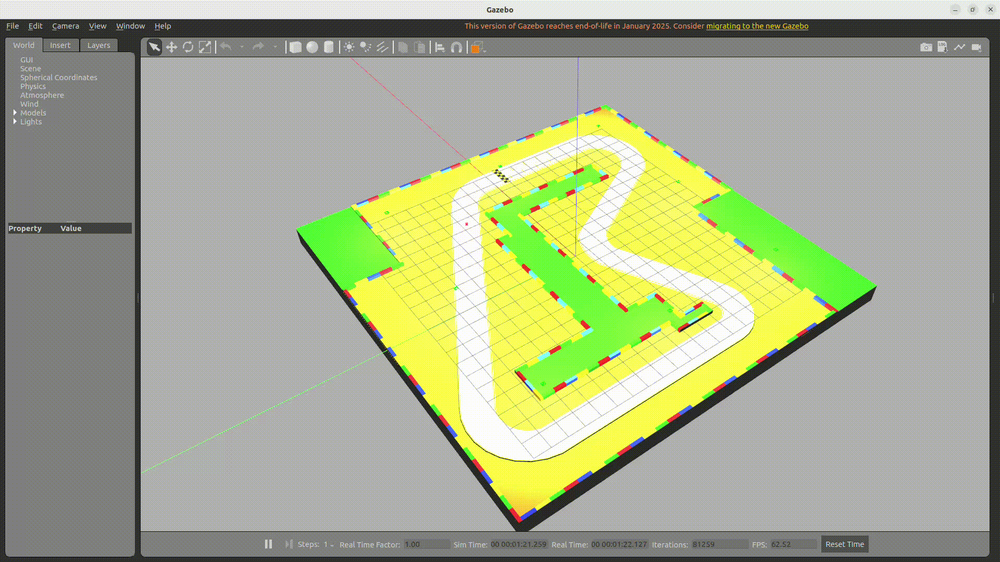</p>

<!-- TABLE OF CONTENTS -->
## Table of Contents
<ol>
    <li>
        <a href="#about-the-project">About The Project</a>
    </li>
    <li>
        <a href="#getting-started">Getting Started</a>
        <ul>
        <li><a href="#prerequisites">Prerequisites</a></li>
            <ul>
                <li><a href="#python-packages">Python packages</a></li>
                <li><a href="#ros2-packages">ROS2 packages</a></li>
            </ul>
        <li><a href="#installation">Installation</a></li>
        </ul>
    </li>
    <li><a href="#usage">Usage</a></li>
    <ul>
        <li><a href="#launch-the-project">Launch the project</a></li>
        <li><a href="#run-the-controller-node">Run the controller node</a></li>
    </ul>
    <li><a href="#kinematics-of-mobile-robot">Kinematics of Mobile robot</a></li>
        <ul>
            <li><a href="#1-robot-model">Robot model</a></li>
            <li><a href="#2-inverse-kinematics-models">Inverse Kinematics Models</a></li>
            <li><a href="#3-forward-kinematics-models">Forward Kinematics Models</a></li>
            <li><a href="#4-validation">Validation</a></li>
            <li><a href="#5-model-selection-guide">Model selection guide</a></li>
        </ul>
    <li><a href="#path-tracking-controller">Path tracking controller</a></li>
    <li><a href="#state-estimator">State estimator</a></li>
    <ul>
        <li><a href="#introduction-to-kalman-filter">Introduction to Kalman Filter</a></li>
        <li><a href="#understanding-matrix-q-and-r">Understanding Matrix Q and R</a></li>
        <li><a href="#tuning-q-and-r">Tuning Q and R</a></li>
        <li><a href="#implementation">Implementation</a></li>
        <li><a href="#validation">Validation</a></li>
        <li><a href="#applications">Applications</a></li>
    </ul>
    <li><a href="#contributors">Contributors</a></li>
</ol>

<!-- ABOUT THE PROJECT -->
## About The Project

This project is in FRA532(Mobile Robotics) class at **FIBO** that teach about Mobile robotics. So **LAB1** is the one of class's lab that have 3 sub-labs that are kinematics of mobile robot, path tracking controller, and state estimator.

<!-- GETTING STARTED -->
## Getting Started

### Prerequisites

To use this project. You need to have all of prerequisites for this project.

#### Python packages

⚠️ **Warning:** Make sure you have python version >= 3.6 already.

*   numpy

    ```
    pip3 install numpy
    ```

*   matplotlib

    ```
    pip3 install matplotlib
    ```

* tf_transformations

    ```
    pip3 install tf_transformations
    ```

* pyyaml

    ```
    pip3 install pyyaml
    ```

#### ROS2 packages

⚠️ **Warning:** Make sure you have ROS2 humble and gazebo classic already.

* robot state publisher

    ```
    sudo apt install ros-humble-robot-state-publisher
    ```

* ros2 control

    ```
    sudo apt install ros-humble-ros2-control
    ```

* ros2 controllers

    ```
    sudo apt install ros-humble-ros2-controllers
    ```

* gazebo ros2 control

    ```
    sudo apt install ros-humble-gazebo-ros2-control
    ```

### Installation

Follow the command below to dowload and install package.

1.  Go to home directory

    ```
    cd
    ```

2.  Clone the repository and change directory to workspace

    ```
    git clone https://github.com/itsnotthetim/FRA532_LAB1.git
    cd FRA532_LAB1
    ```

3.  Build & Source the packages

    ```
    colcon build
    source install/setup.bash
    ```

<p align="right">(<a href="#fra532-lab1">back to top</a>)</p>

<!-- USAGE -->
## Usage

⚠️  **Warning:**    Before use this project you need to `source ~/FRA532_LAB1/install/setup.bash` and `source /opt/ros/humble/setup.bash` everytime that you open new terminal. If you want to make sure that 2 path has been source everytime when open new terminal you can follow the command below and next time you open new terminal .bashrc will source everything you write on that file.

```
echo "source ~/FRA532_LAB1/install/setup.bash" >> ~/.bashrc
echo "source /opt/ros/humble/setup.bash" >> ~/.bashrc
source ~/.bashrc
```

### Launch the project

```
ros2 launch ack_description sim.launch.py
```

After launch the project, rviz2 and gazebo window will show up on your screen with ackermann robot in gazebo world like this picture below.

<p align="center">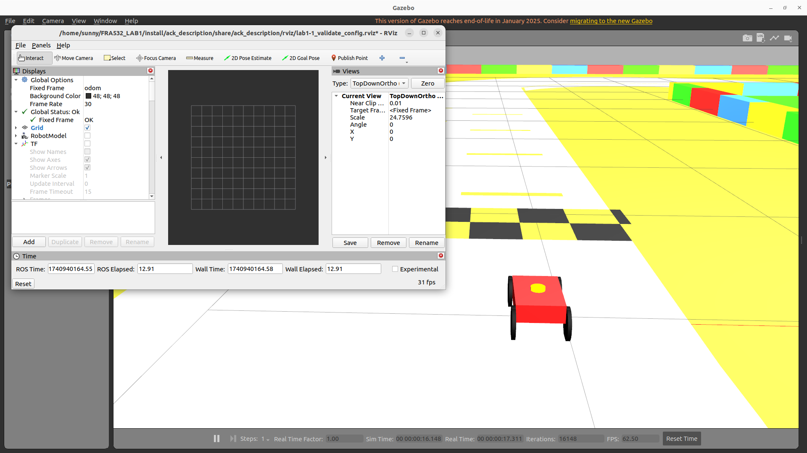</p>

### Run the controller node

To use controller for path tracking in lab 1.2 and 1.3, you can use this command below to start the controller node.

```
ros2 run ackermann_controller <controller_node>
```

Example: To run the pure pursuit controller you can use this command below.

```
ros2 run ackermann_controller pure_pursuit_controller.py
```

This step will explain more in <a href="#path-tracking-controller">Lab 1.2</a> section.

<p align="right">(<a href="#fra532-lab1">back to top</a>)</p>

## Kinematics of Mobile robot

This section provided robot model with inverse and forward kinematics for simulate, control, and calculate odometry of robot.

### 1. Robot model

#### 1.1 Robot description

Robot description is the part that have to use for visualize in rviz and simulate in gazebo. You can check our robot description <a href="src/ack_description/urdf/robot.xacro">here</a>.

<p align="center">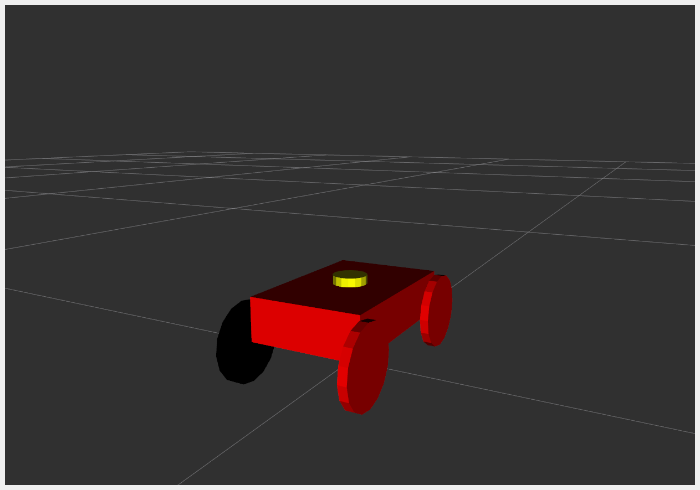</p>

This model is based on intruction of this lab, see below.

<p align="center">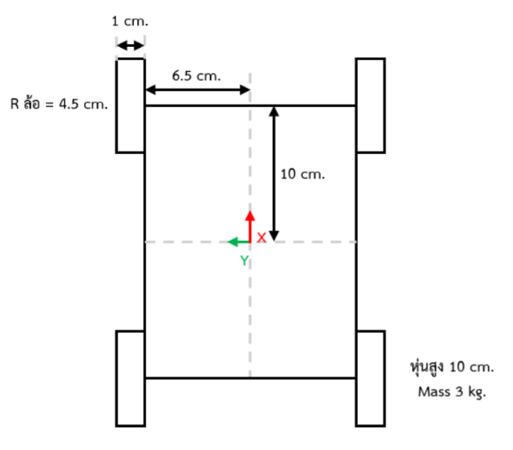</p>

Additionaly, for <a href="#31-yaw-rate-model">Yaw-Rate Model</a> we add imu sensor frame (yellow cylinder on the head) to simulate imu sensor and link it into gazebo.

#### 1.2 Transformation

<p align="center">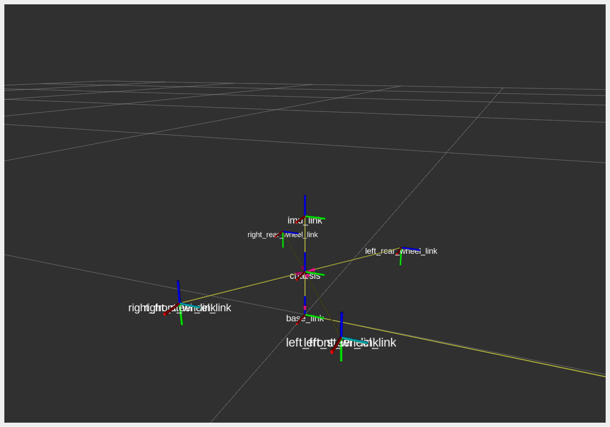</p>

The transformation tree is:

* base_link
    * chassis
        * left_rear_wheel_link
        * left_steer_link
            * left_front_wheel_link
        * right_rear_wheel_link
        * right_steer_link
            * right_front_wheel_link
        * imu_link

And after we create robot odometry transformation tree will change into this:

* world
    * odom
        * base_link
            * chassis
                * left_rear_wheel_link
                * left_steer_link
                    * left_front_wheel_link
                * right_rear_wheel_link
                * right_steer_link
                    * right_front_wheel_link
                * imu_link

If we use `view frame` of `tf2_tools`, the result is a image below.

<p align="center">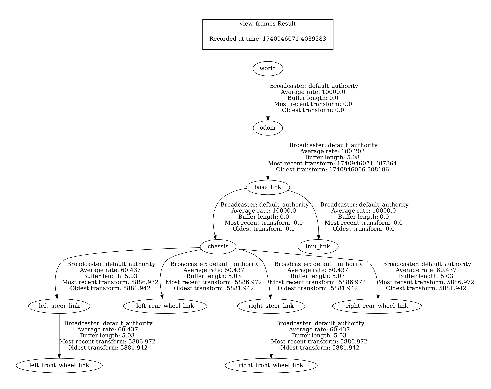</p>

### 2. Inverse Kinematics Models

Inverse kinematics models is using for calculate twist at robot frame into wheel speed.

#### 2.1 Bicycle Model

<p align="center">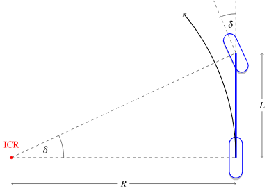</p>

**Description**  

- A simplified model representing a four-wheel Ackermann vehicle using one front steering wheel and one rear driving wheel.  
- The front wheel turns at an angle $\delta$, and the rear wheel drives the vehicle forward.

**Key Equations** 

$$
\dot{x} = v \cos(\theta)
$$

$$
\dot{y} = v \sin(\theta)
$$

$$
\dot{\theta} = \frac{v}{L} \tan(\delta)
$$

To find the required steering angle $\delta$:

$$
\delta = \arctan\left(\frac{L \dot{\theta}}{v}\right)
$$

#### 2.2 No-Slip Condition Model

<p align="center">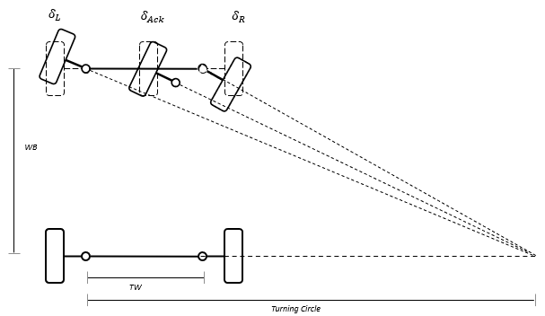</p>

**Description**  
- Assumes that wheels roll without slipping, meaning all wheels must share the same turning center.  
- The left and right front wheels turn at different angles to follow Ackermann steering.

**Key Equations**  

$$
\cot(\delta_L) - \cot(\delta_R) = \frac{TW}{WB}
$$

$$
\delta_{Ack} = \frac{\delta_{in}}{\gamma}
$$

$$
\delta_L = \tan^{-1}\left( \frac{WB \cdot \tan(\delta_{Ack})}{WB + 0.5 \cdot TW \cdot \tan(\delta_{Ack})} \right)
$$

$$
\delta_R = \tan^{-1}\left( \frac{WB \cdot \tan(\delta_{Ack})}{WB - 0.5 \cdot TW \cdot \tan(\delta_{Ack})} \right)
$$

Where:
- $\delta_L$ and $\delta_R$ are the left and right wheel angles, respectively.
- $\delta_{Ack}$ is the Ackermann angle.
- $\delta_{in} $ is the input steering angle.
- $ \gamma$ is a scaling factor.
- $TW$ is the track width (distance between the left and right wheels).
- $ WB $ $is the wheelbase (distance between the front and rear axles).
- $P_{Ack}$ is the Ackermann percentage.

---

⚠️ *In case, the code for the Bicycle model and the No-Slip Condition Constraints model shares similar equations, the implementation will be mostly the same, with some differences specific to each model. The code will look like this.*

```python 
    def cmd_vel_callback(self, msg: Twist):
            self.linear_velocity = msg.linear.x  # Forward velocity (m/s)
            self.angular_velocity = msg.angular.z  # Rotation velocity (rad/s)

            if self.linear_velocity != 0.0:
                # Bicycle Model
                delta = math.atan((self.WB * self.angular_velocity) / self.linear_velocity)

                # Ackerman Steering Type: No-Slip
                delta_Ack = delta / self.gamma
                delta_L = math.atan((self.WB * math.tan(delta_Ack)) / (self.WB - 0.5 * self.TW * math.tan(delta_Ack)))
                delta_R = math.atan((self.WB * math.tan(delta_Ack)) / (self.WB + 0.5 * self.TW * math.tan(delta_Ack)))
            
            else:
                delta = 0.0
                delta_Ack = 0.0
                delta_L = 0.0
                delta_R = 0.0

            
            if self.model == 'bicycle':
                steering_angle_left_wheel = delta
                steering_angle_right_wheel = delta
            elif self.model == 'ackermann':
                steering_angle_left_wheel = delta_L
                steering_angle_right_wheel = delta_R

            speed_rear_wheel = self.linear_velocity / self.wheel_radius
```

### 3. Forward Kinematics Models

Forward kinematics models is using for calculate wheel speed into robot twist(at robot frame).

#### 3.1 Yaw-Rate Model

<p align="center">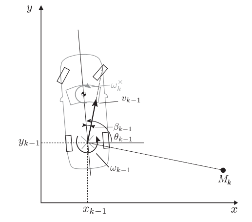</p>

**Description**

- Yaw Rate model estimates a vehicle’s rotational speed around its vertical axis, essential for dead reckoning-based odometry. By integrating the yaw rate over time, the robot or vehicle can estimate its heading. This is often combined with wheel encoder data and IMU (Inertial Measurement Unit) readings to improve accuracy in mobile robots and self-driving cars (Autonomous).

**Key Equations** 

$$
\begin{align*}
\begin{bmatrix}
x_k \\
y_k \\
\theta_k \\
\beta_k \\
v_k \\
\omega_k
\end{bmatrix}
&=
\begin{bmatrix}
y_{k-1} + v_{k-1} \cdot \Delta t \cdot \cos\left(\beta_{k-1} + \theta_{k-1} + \frac{\omega_{k-1} \cdot \Delta t}{2}\right) \\
y_{k-1} + v_{k-1} \cdot \Delta t \cdot \sin\left(\beta_{k-1} + \theta_{k-1} + \frac{\omega_{k-1} \cdot \Delta t}{2}\right) \\
\theta_{k-1} + \omega_{k-1} \cdot \Delta t \\
\beta_{R,k}^{\ast} \\
\frac{v_{R,L,k}^{\ast} + v_{R,R,k}^{\ast}}{2} \\
\quad \frac{v_{k-1}}{r_b} \left(\cos(\beta_{R,k}^{\ast}) \cdot (\tan(\beta_{F,k}^{\ast}) - \tan(\beta_{R,k}^{\ast}))\right)
\end{bmatrix}
\end{align*}
$$

#### 3.2 Single-Track Model

<p align="center">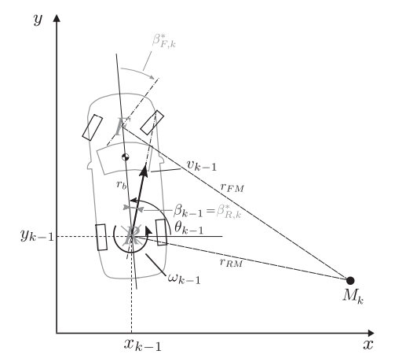</p>

**Description**

- Single-Track model approximates a four-wheeled vehicle as a single-track system, treating both left and right wheels as one virtual wheel per axle. 
- It simplifies kinematic calculations for estimating the vehicle's position and orientation to determine velocity and heading changes..

**Key Equations**

$$\begin{align*}
\begin{bmatrix}
x_k \\
y_k \\
\theta_k \\
\beta_k \\
v_k \\
\omega_k
\end{bmatrix}
&=
\begin{bmatrix}
y_{k-1} + v_{k-1} \cdot \Delta t \cdot \cos\left(\beta_{k-1} + \theta_{k-1} + \frac{\omega_{k-1} \cdot \Delta t}{2}\right) \\
y_{k-1} + v_{k-1} \cdot \Delta t \cdot \sin\left(\beta_{k-1} + \theta_{k-1} + \frac{\omega_{k-1} \cdot \Delta t}{2}\right) \\
\theta_{k-1} + \omega_{k-1} \cdot \Delta t \\
\beta_{R,k}^{\ast} \\
\frac{v_{R,L,k}^{\ast} + v_{R,R,k}^{\ast}}{2} \\
\quad \frac{v_{k-1}}{r_b} \left(\cos(\beta_{R,k}^{\ast}) \cdot (\tan(\beta_{F,k}^{\ast}) - \tan(\beta_{R,k}^{\ast}))\right)
\end{bmatrix}
\end{align*}$$

#### 3.3 Double-Track Model

<p align="center">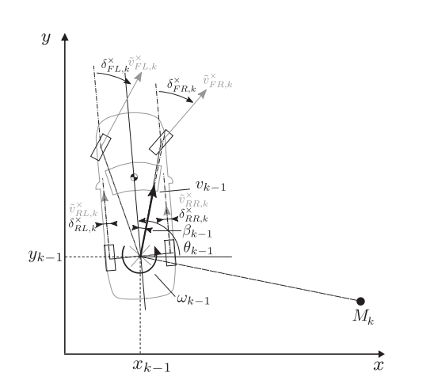</p>

**Description**

- Double-Track model considers each wheel independently to make it more precise for odometry. By accounts for lateral wheel slips, load transfers, and individual wheel speeds. This is useful in high-accuracy odometry for vehicles with independent drive wheels or complex dynamics like four-wheeled mobile robots (ackerman model like we did). 

**Key Equations**

$$\begin{align*}
\begin{bmatrix}
x_k \\
y_k \\
\theta_k \\
\beta_k \\
v_k \\
\omega_k
\end{bmatrix}
&=
\begin{bmatrix}
x_{k-1} + v_{k-1} \cdot \Delta t \cdot \cos\left(\beta_{k-1} + \theta_{k-1} + \frac{\omega_{k-1} \cdot \Delta t}{2}\right) \\
y_{k-1} + v_{k-1} \cdot \Delta t \cdot \sin\left(\beta_{k-1} + \theta_{k-1} + \frac{\omega_{k-1} \cdot \Delta t}{2}\right) \\
\theta_{k-1} + \omega_{k-1} \cdot \Delta t \\
0 \\
\frac{\tilde{v}_{RL,k} + \tilde{v}_{RR,k}}{2} \\
\frac{\tilde{v}_{RR,k} - \tilde{v}_{RL,k}}{TW}
\end{bmatrix}
\end{align*}$$

---

⚠️ *The code for all three models has a similar structure but differs in some equations, like those involving $\omega_k$, the implementation will mostly be the same, with some variations for each model. The code will look like this:*

```python
    def state_space(self):
        self.update_state_space = [0, 0, 0, 0, 0, 0]
        self.update_state_space[0] = self.odom[0] + (self.odom[4] * self.dt * math.cos(self.odom[3] + self.odom[2] + (self.odom[5]* self.dt)/2))
        self.update_state_space[1] = self.odom[1] + (self.odom[4] * self.dt * math.sin(self.odom[3] + self.odom[2] + (self.odom[5]* self.dt)/2))
        self.update_state_space[2] = self.odom[2] + (self.odom[5] * self.dt)
        self.update_state_space[4] = (self.rear_vel[0] + self.rear_vel[1]) / 2

        if(self.kinematic_model == 'single_track'):
            self.update_state_space[5] = (self.odom[4]/self.wheelbase) * math.tan(self.delta)
        elif(self.kinematic_model == 'double_track'):
            self.update_state_space[5] = (self.rear_vel[0] - self.rear_vel[1]) / self.track_width
        elif(self.kinematic_model == 'yaw_rate'):
            self.update_state_space[5] = self.yaw
        if self.kinematic_model != 'ground_truth':
            self.odom = self.update_state_space
            self.odom_pub(self.odom)
        else:
            self.odom = self.odom_ground_truth
            self.odom_pub(self.odom_ground_truth)
```

---

### 4. Validation

To compare and validate the result, we have to analyze as follows:

1. Position.
2. Orientation.
3. Linear velocity.
4. Angular velocity.

For see which model is stronger in which aspect or what is the strong point of those models. Additionally, the results will based on <a href="#2-inverse-kinematics-models">inverse kinematics model</a>.

⚠️ **In the validation process, we use <a href="#pure-pursuit-controller">pure pursuit controller </a> to be our controller to move the robot around the map via tracking the path.**

The results for each model are shown in the following graphs below:

1. Bicycle Model

    * Path tracking velocity = 0.25 m/s

        <p align="center">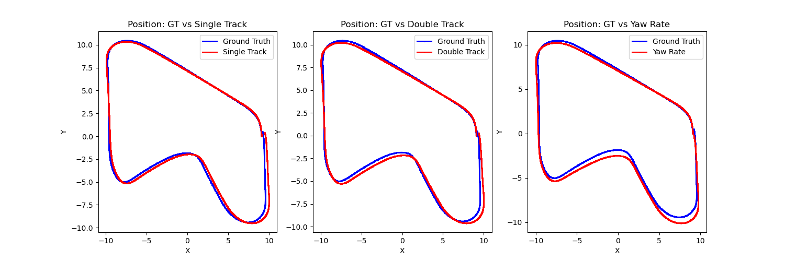</p>

        <p align="center">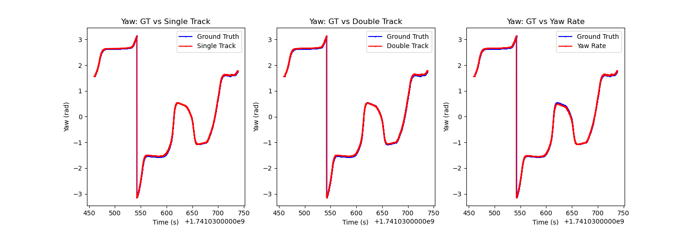</p>

        <p align="center">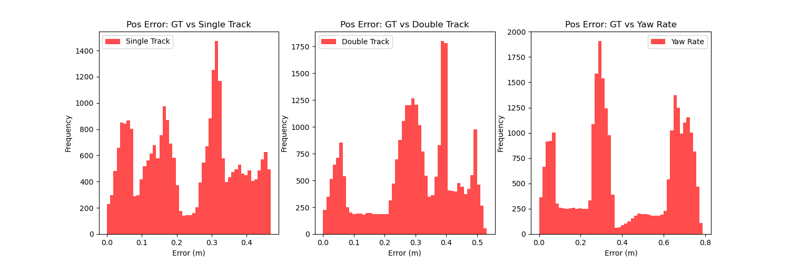</p>

        <p align="center">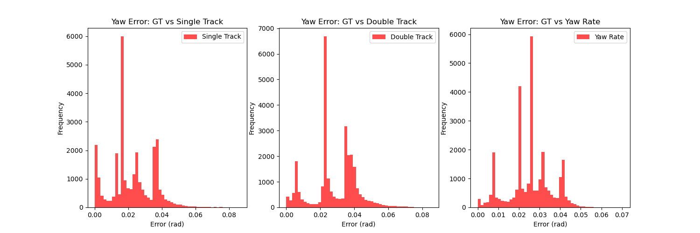</p>

    * Path tracking velocity = 0.5 m/s

        <p align="center">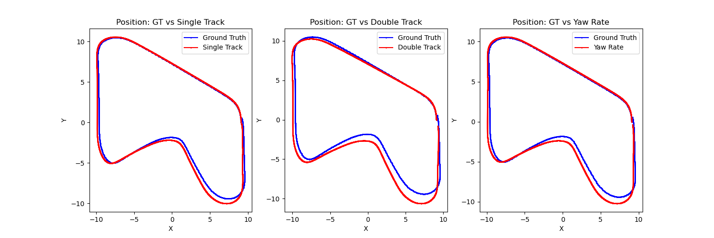</p>

        <p align="center">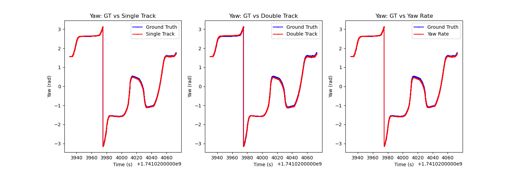</p>

        <p align="center">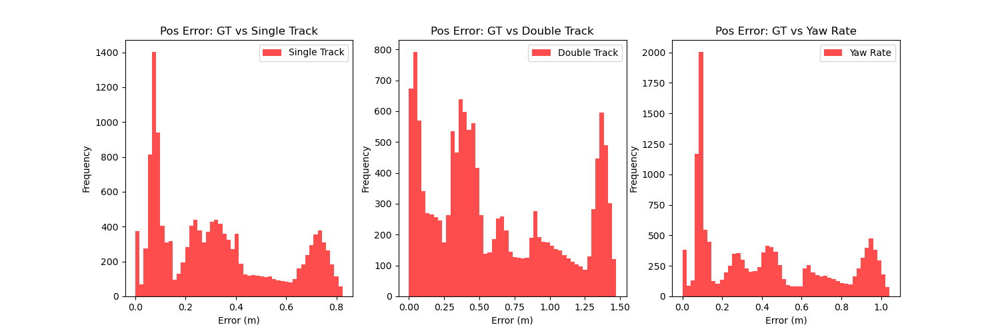</p>

        <p align="center">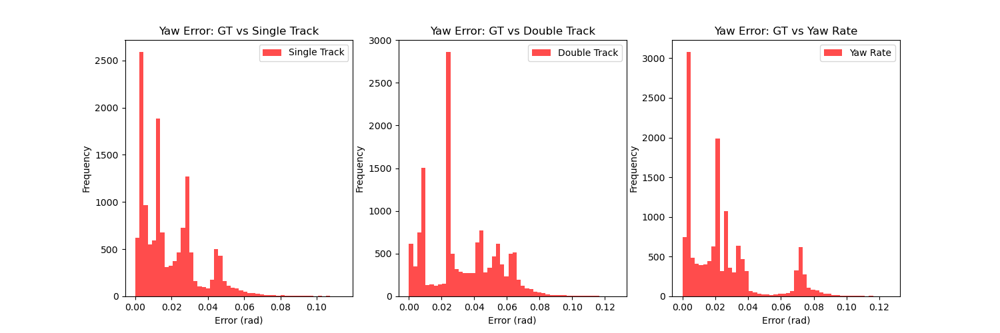</p>

2. No-Slip Condition Model

    * Path tracking velocity = 0.25 m/s

        <p align="center">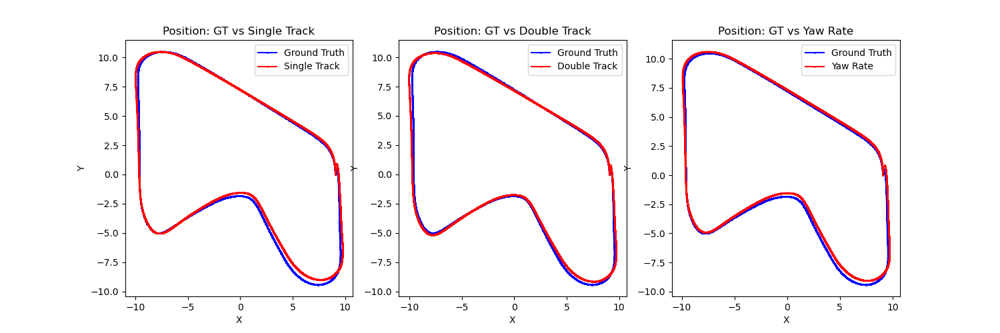</p>

        <p align="center">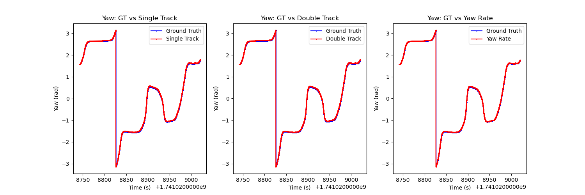</p>

        <p align="center">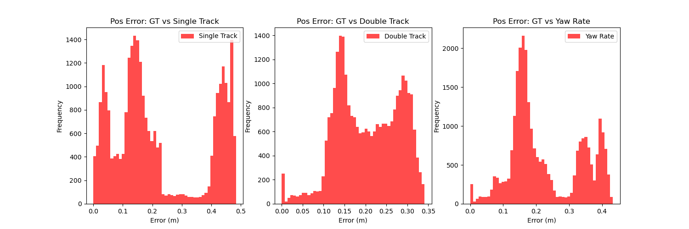</p>

        <p align="center">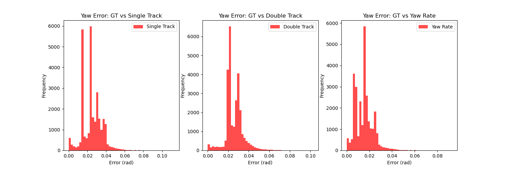</p>

    * Path tracking velocity = 0.5 m/s

        <p align="center">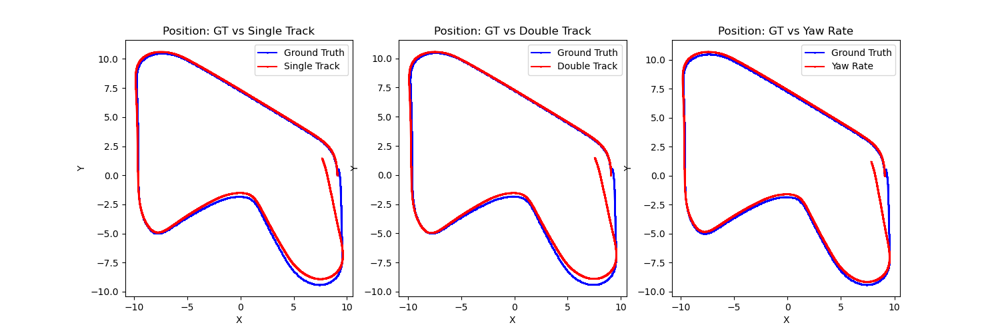</p>

        <p align="center">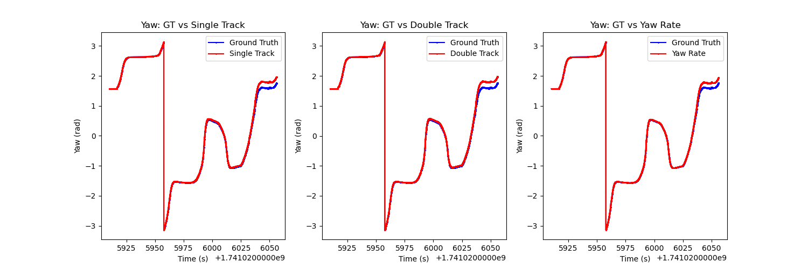</p>

        <p align="center">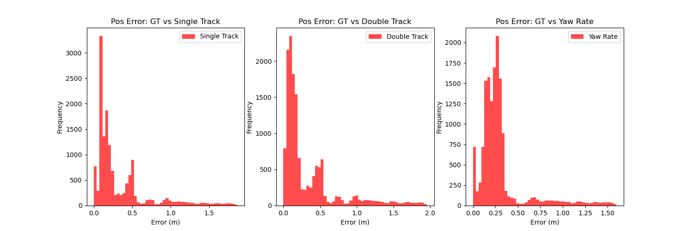</p>

        <p align="center">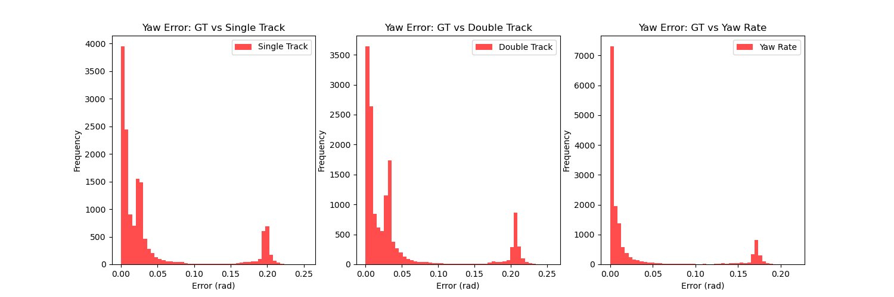</p>

**Conclusion:**


### 5. Model selection guide

- **Inverse Kinematics**  
  - **Bicycle Model**: Best for simple path-following and control.  
  - **No-Slip Model**: Best for precise low-speed maneuvers.  

- **Forward Kinematics**  
  - **Yaw-Rate Model**: Easy to implement; works well with IMU.  
  - **Single-Track Model**: More accurate for steering-based motion.  
  - **Double-Track Model**: Best for high-speed and complex dynamics. 

<p align="right">(<a href="#fra532-lab1">back to top</a>)</p>

## Path tracking controller

Path tracking controller or local planner is the algorithm to tracking the path that given from somewhere like global planner. The goal of this algorithm is based on what mission robot need to do, in this case is only to track the path.

### Controller selection

To select the controllers that given by instruction(PID, Pure Pursuit, Linear MPC, and Stanley). We based on the mission of robot that is tracking the path. And all of controllers in instruction can track the path. So we selected them by using this rules below.

1. EiEi
2. EuEu
3. EaEA

### PID controller


### Pure Pursuit controller


### Stanley controller


<p align="right">(<a href="#fra532-lab1">back to top</a>)</p>

## State estimator

For accurate localization in mobile robot application, we use extended kalman filter to do sensor fusion for more accurate odometry.

### Introduction to Kalman Filter

The **Kalman Filter** is an optimal recursive Bayesian estimator that predicts the state of a dynamic system and updates its estimates based on noisy sensor measurements. It assumes that the system follows a linear Gaussian model and consists of two main steps:

1. **Prediction:** The filter predicts the next state based on the motion model.
2. **Update (Correction):** The filter updates its state estimate using sensor observations.

For nonlinear systems, the **Extended Kalman Filter (EKF)** linearizes the system at each time step.

### Problem Formulation

Given a mobile robot operating in a 2D space, the goal is to estimate its **position**  $\mu$  and **orientation**  $\theta$  based on odometry and sensor readings.

#### State Representation

The system state is represented as:

$$X_k = \begin{bmatrix} x_k \\ y_k \\ \theta_k \end{bmatrix}$$

where:
- $x_k$ , $y_k$ are the position coordinates.
- $\theta_k$  is the orientation angle.

#### Motion Model (Prediction Step)

The robot's motion is modeled by a control input \($U_k$\), which includes the velocity \($v_k$\) and angular velocity \($\omega_k$\):

$$X_{k+1} = f(X_k, U_k) + w_k$$

where:

$$\begin{bmatrix} x_{k+1} \\ y_{k+1} \\ \theta_{k+1} \end{bmatrix} =
\begin{bmatrix} x_k + v_k \Delta t \cos\theta_k \\ y_k + v_k \Delta t \sin\theta_k \\ \theta_k + \omega_k \Delta t \end{bmatrix} + w_k$$


- $w_k \sim \mathcal{N}(0, Q_k)$ represents process noise with covariance $Q_k$.

#### Observation Model (Update Step)

Sensor measurements  $Z_k$  provide noisy observations of the actual state:

$$Z_k = h(X_k) + v_k$$

where:

$$Z_k = \begin{bmatrix} x_k^m \\ y_k^m \end{bmatrix} + v_k$$
and $v_k \sim \mathcal{N}(0, R_k)$ is the measurement noise with covariance $R_k$.

#### EKF Algorithm Steps

1. **Prediction Step:**

   $$\hat{X}_{k+1} = f(X_k, U_k)$$
   
   $$P_{k+1} = F_k P_k F_k^T + Q_k$$
   where $F_k$ is the Jacobian of $f(X_k, U_k)$.

2. **Update Step:**
   
   $$K_k = P_k H_k^T (H_k P_k H_k^T + R_k)^{-1}$$
 
   $$X_k = \hat{X}_k + K_k (Z_k - h(\hat{X}_k))$$
   
   $$P_k = (I - K_k H_k) P_k$$
  
   where H_k$ is the Jacobian of the measurement function \($h(X_k)$\), and K_k$ is the **Kalman Gain**.

### Understanding Matrix Q and R

#### Process Noise Covariance Matrix (Q)

- Represents uncertainty in the system's **motion model** due to unmodeled dynamics, control input inaccuracies, and external disturbances.
- Mathematically influences the state covariance update in the **prediction step**:
  
    $$P_{k+1} = F_k P_k F_k^T + Q_k$$ 
  
- **Large Q:** The filter adapts quickly but produces noisy estimates.
- **Small Q:** The filter is stable but slow to respond to changes.

#### Measurement Noise Covariance Matrix (R)

- Represents uncertainty in **sensor measurements** due to sensor resolution limits, environmental interference, and sampling variations.
- Influences the **update step**:
  
   $$S_k = H_k P_k H_k^T + R_k$$ 
  
- **Large R:** The filter trusts the motion model more, reducing sensitivity to sensor noise but slowing adaptation.
- **Small R:** The filter follows sensor readings closely but may overreact to noise.

### Tuning Q and R

- **Increase Q** for unpredictable motion.
- **Decrease Q** if estimates vary too much.
- **Increase R** for noisy sensors.
- **Decrease R** if the filter reacts too slowly to changes.

### Implementation

see in <a href="src/ackermann_controller/scripts/ekf_node.py">EKF_Node</a>, that is contains algorithm for Extended Kalman Filter.

### Validation

### Applications

- **Autonomous Vehicles**: Self-driving cars use EKF for position tracking.
- **Mobile Robots**: Localization in SLAM applications.
- **Drones**: Estimating the position and attitude of UAVs.

<p align="right">(<a href="#fra532-lab1">back to top</a>)</p>


## Contributors

1. **Nakarin Jettanatummajit** (65340500033)
2. **Timmy** (653405000xx)

<p align="right">(<a href="#fra532-lab1">back to top</a>)</p>