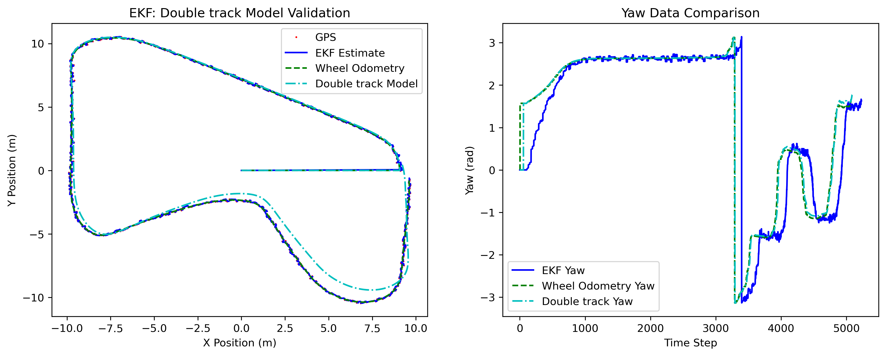
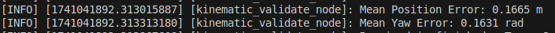
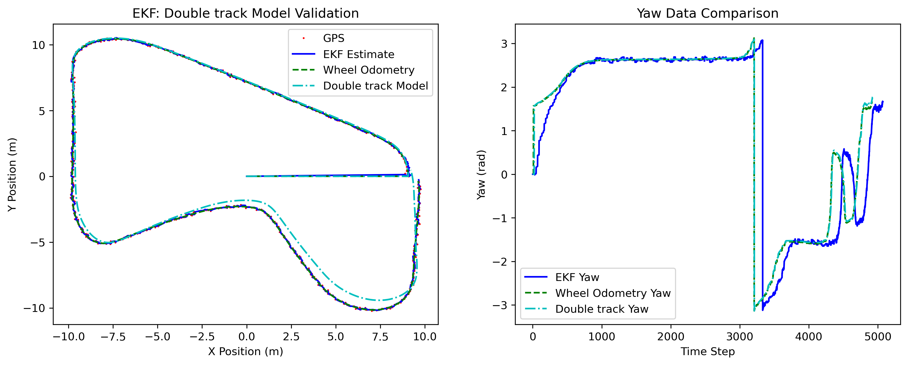
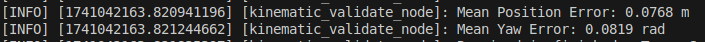
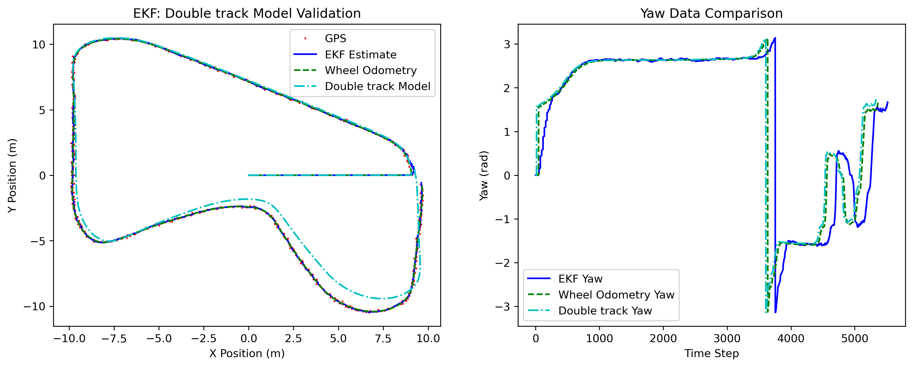
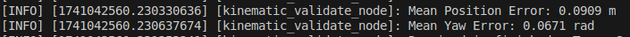
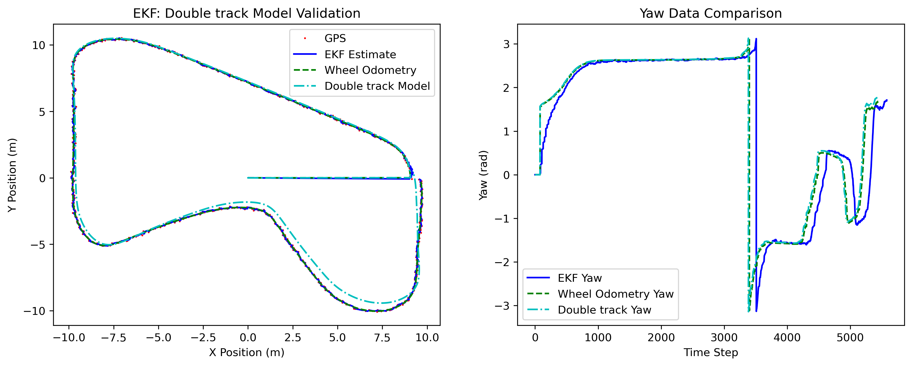
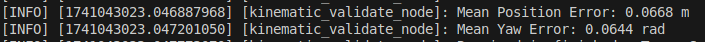
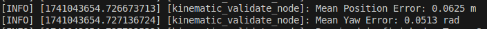

# Extended Kalman Filter Localization:: Position Estimation Using Kalman Filter

## Introduction to Kalman Filter
The **Kalman Filter** is an optimal recursive Bayesian estimator that predicts the state of a dynamic system and updates its estimates based on noisy sensor measurements. It assumes that the system follows a linear Gaussian model and consists of two main steps:

1. **Prediction:** The filter predicts the next state based on the motion model.
2. **Update (Correction):** The filter updates its state estimate using sensor observations.

For nonlinear systems, the **Extended Kalman Filter (EKF)** linearizes the system at each time step.

## Problem Formulation
Given a mobile robot operating in a 2D space, the goal is to estimate its **position**  $\mu$  and **orientation**  $\theta$  based on odometry and sensor readings.

### State Representation
The system state is represented as:

$$X_k = \begin{bmatrix} x_k \\ y_k \\ \theta_k \end{bmatrix}$$

where:
- $x_k$ , $y_k$ are the position coordinates.
- $\theta_k$  is the orientation angle.

### Motion Model (Prediction Step)
The robot's motion is modeled by a control input \($U_k$\), which includes the velocity \($v_k$\) and angular velocity \($\omega_k$\):

$$X_{k+1} = f(X_k, U_k) + w_k$$

where:

$$\begin{bmatrix} x_{k+1} \\ y_{k+1} \\ \theta_{k+1} \end{bmatrix} =
\begin{bmatrix} x_k + v_k \Delta t \cos\theta_k \\ y_k + v_k \Delta t \sin\theta_k \\ \theta_k + \omega_k \Delta t \end{bmatrix} + w_k$$


- $w_k \sim \mathcal{N}(0, Q_k)$ represents process noise with covariance $Q_k$.

### Observation Model (Update Step)
Sensor measurements  $Z_k$  provide noisy observations of the actual state:

$$Z_k = h(X_k) + v_k$$

where:

$$Z_k = \begin{bmatrix} x_k^m \\ y_k^m \end{bmatrix} + v_k$$
and $v_k \sim \mathcal{N}(0, R_k)$ is the measurement noise with covariance $R_k$.

### EKF Algorithm Steps
1. **Prediction Step:**

   $$\hat{X}_{k+1} = f(X_k, U_k)$$
   
   $$P_{k+1} = F_k P_k F_k^T + Q_k$$
   where $F_k$ is the Jacobian of $f(X_k, U_k)$.

2. **Update Step:**
   
   $$K_k = P_k H_k^T (H_k P_k H_k^T + R_k)^{-1}$$
 
   $$X_k = \hat{X}_k + K_k (Z_k - h(\hat{X}_k))$$
   
   $$P_k = (I - K_k H_k) P_k$$
  
   where H_k$ is the Jacobian of the measurement function \($h(X_k)$\), and K_k$ is the **Kalman Gain**.

## Understanding Matrix Q and R

### Process Noise Covariance Matrix (Q)
- Represents uncertainty in the system's **motion model** due to unmodeled dynamics, control input inaccuracies, and external disturbances.
- Mathematically influences the state covariance update in the **prediction step**:
  
    $$P_{k+1} = F_k P_k F_k^T + Q_k$$ 
  
- **Large Q:** The filter adapts quickly but produces noisy estimates.
- **Small Q:** The filter is stable but slow to respond to changes.

So the matix $ Q$ should be like this


$$Q =
\begin{bmatrix}
\sigma_x^2 & 0 & 0 \\
0 & \sigma_y^2 & 0 \\
0 & 0 & \sigma_\theta^2
\end{bmatrix}$$


where:

-  $\sigma_x^2 $ and  $\sigma_y^2 $ represent **position uncertainty** (meters²),
-  $\sigma_\theta^2$  represents **heading uncertainty** (radians²).


### Measurement Noise Covariance Matrix (R)
- Represents uncertainty in **sensor measurements** due to sensor resolution limits, environmental interference, and sampling variations.
- Influences the **update step**:
  
   $$S_k = H_k P_k H_k^T + R_k$$ 
  
- **Large R:** The filter trusts the motion model more, reducing sensitivity to sensor noise but slowing adaptation.
- **Small R:** The filter follows sensor readings closely but may overreact to noise.


#### Since the GPS provides measurements for x and y positions, the R matrix should be:


Given that the GPS noise standard deviation is 0.05 meters, the variance is:


Thus, R should be:

```python
self.R = np.diag([0.0025, 0.0025])  # Fixed measurement noise covariance
```

- This assumes 0.05m standard deviation in GPS readings for both x and y.

- The EKF trusts GPS moderately but filters out small fluctuations.

## Implementation
```python
#!/usr/bin/env python3

import rclpy
from rclpy.node import Node
import numpy as np
from nav_msgs.msg import Odometry
from geometry_msgs.msg import PoseStamped, Quaternion
import tf_transformations


class EKFLocalization(Node):
    def __init__(self):
        super().__init__('ekf_localization')

        # Subscribe to odometry and GPS
        self.odom_sub = self.create_subscription(Odometry, '/double_track/odom', self.odom_callback, 10)
        self.gps_sub = self.create_subscription(PoseStamped, '/gps', self.gps_callback, 10)

        # Publisher for fused odometry
        self.ekf_pub = self.create_publisher(Odometry, '/ekf_odom', 10)

        # State vector: [x, y, theta]
        self.x_est = np.array([0.0, 0.0, 0.0])  # Initial estimate
        self.P_est = np.eye(3) * 1.0  # Initial covariance matrix

        # Process and measurement noise covariance matrices
        
        self.R = np.diag([0.025, 0.025])  # Based on GPS measurement noise

       
        self.Q = np.diag([0.01, 0.01, 0.01]) 
        # self.Q = np.diag([0.001, 0.001, 0.001])
        # self.Q = np.diag([0.0001, 0.0001, 0.0001])  
        # self.Q = np.diag([0.001, 0.001, 0.0001]) 
        # self.Q = np.diag([0.0005, 0.0005, 0.0002]) 
        
        # Time step
        self.dt = 0.01

    def odom_callback(self, msg):
        """ EKF Prediction Step using Odometry """
        v = msg.twist.twist.linear.x  # Forward velocity
        omega = msg.twist.twist.angular.z  # Angular velocity
        theta = self.x_est[2]

        # State transition function (Prediction)
        x_pred = np.array([
            self.x_est[0] + v * np.cos(theta) * self.dt,
            self.x_est[1] + v * np.sin(theta) * self.dt,
            self.x_est[2] + omega * self.dt
        ])

        # Jacobian of motion model (F)
        F = np.array([
            [1, 0, -v * np.sin(theta) * self.dt],
            [0, 1,  v * np.cos(theta) * self.dt],
            [0, 0,  1]
        ])

        # Predicted covariance
        P_pred = F @ self.P_est @ F.T + self.Q

        # Update estimated values
        self.x_est = x_pred
        self.P_est = P_pred

        # Publish the updated estimate
        self.publish_estimate()

    def gps_callback(self, msg):
        """ EKF Update Step using GPS """
        z = np.array([msg.pose.position.x, msg.pose.position.y])  # Measurement

        # Measurement matrix (H)
        H = np.array([[1, 0, 0], [0, 1, 0]])

        # Innovation (residual)
        y = z - H @ self.x_est

        # Innovation covariance
        S = H @ self.P_est @ H.T + self.R

        # Kalman Gain
        K = self.P_est @ H.T @ np.linalg.inv(S)

        # Updated state estimate
        self.x_est = self.x_est + K @ y

        # Updated covariance
        self.P_est = (np.eye(3) - K @ H) @ self.P_est

        # Publish the updated estimate
        self.publish_estimate()

    def publish_estimate(self):
        """ Publish the EKF estimated pose as Odometry message """
        odom_msg = Odometry()
        odom_msg.header.stamp = self.get_clock().now().to_msg()
        odom_msg.header.frame_id = "odom"

        # Assign estimated state
        odom_msg.pose.pose.position.x = self.x_est[0]
        odom_msg.pose.pose.position.y = self.x_est[1]

        # Convert theta (yaw) to quaternion
        q = tf_transformations.quaternion_from_euler(0, 0, self.x_est[2])
        odom_msg.pose.pose.orientation = Quaternion(x=q[0], y=q[1], z=q[2], w=q[3])

        self.ekf_pub.publish(odom_msg)


def main(args=None):
    rclpy.init(args=args)
    node = EKFLocalization()
    rclpy.spin(node)
    node.destroy_node()
    rclpy.shutdown()


if __name__ == '__main__':
    main()

```
## Tuning Configurations and Results

We tested five different settings for **Q** and recorded the errors. Here are the results:

### 1. Initial Configuration 


- **Q**: `np.diag([0.01, 0.01, 0.01])`
- **Mean Position Error**: `0.1665 m`
- **Mean Yaw Error**: `0.1631 rad`



---

### 2. First Decrease in Q 


- **Q**: `np.diag([0.001, 0.001, 0.001])`
- **Mean Position Error**: `0.0768 m`
- **Mean Yaw Error**: `0.0819 rad`



---

### 3. Second Decrease in Q 


- **Q**: `np.diag([0.0001, 0.0001, 0.0001])`
- **Mean Position Error**: `0.0909 m`
- **Mean Yaw Error**: `0.0671 rad`



---

### 4. First Adjustment (`db_adj1.png`)


- **Q**: `np.diag([0.001, 0.001, 0.0001])`
- **Mean Position Error**: `0.0668 m`
- **Mean Yaw Error**: `0.0644 rad`



---

### 5. Second Adjustment (`db_adj2.png`)


- **Q**: `np.diag([0.0005, 0.0005, 0.0002])`
- **Mean Position Error**: `0.0625 m`
- **Mean Yaw Error**: `0.0513 rad`



---

## Interpretation

### Initial Configuration
- **High Errors**: The initial guess had large errors because the filter trusted the motion model too much.

### First Decrease in Q
- **Better Accuracy**: Reduce **Q** to make the filter rely more on sensor data, which improved accuracy.

### Second Decrease in Q
- **Slight Problems**: Making **Q** even smaller caused the filter to trust the sensors too much, leading to small errors in position.

### First Adjustment
- **Good Balance**: Adjust **Q** to `[0.001, 0.001, 0.0001]` to gave a good mix of trusting the motion model and sensor data.

### Second Adjustment
- **Best Performance**: The final setting (`[0.0005, 0.0005, 0.0002]`) gave the lowest errors, making it the best choice.

**For the further tuning might not give the better result (not showing the significant difference) and will output the similar result (Probably the limitation ability of model, etc.)**

---

## Conclusion

- **Tuning Q**: Finding the right balance for **Q** is key to making the EKF work well.
- **Best Setting**: The setting `np.diag([0.0005, 0.0005, 0.0002])` gave closer the optimal result.
---


